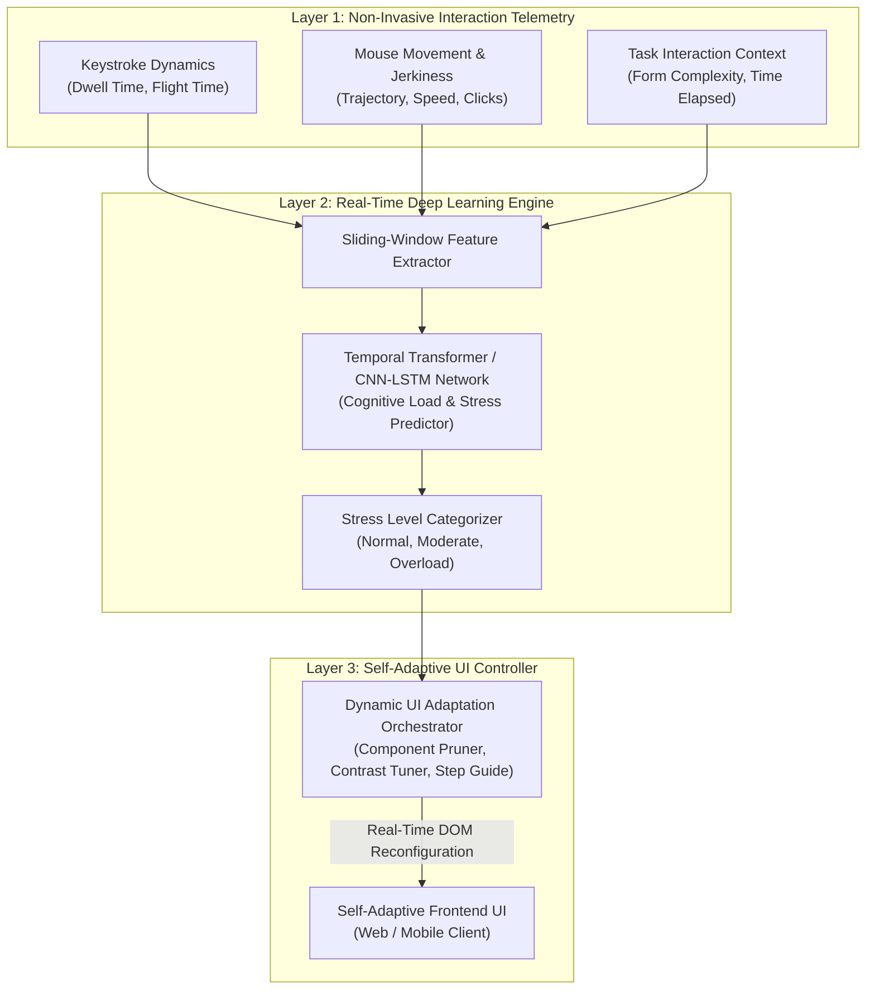

# 🏛️ Topik 01 (Rekomendasi Utama)
# Kerangka Kerja Antarmuka Pengguna Adaptif Cerdas Berbasis Deteksi Beban Kognitif dan Technostress Secara Real-Time Menggunakan Deep Neural Networks

* **Judul Disertasi (Bahasa Indonesia):**  
  *Kerangka Kerja Antarmuka Pengguna Adaptif Cerdas Berbasis Deteksi Beban Kognitif dan Technostress Secara Real-Time Menggunakan Deep Neural Networks*
* **Judul Disertasi (Bahasa Inggris):**  
  *Intelligent Adaptive User Interface Framework Based on Real-Time Cognitive Load and Technostress Detection Using Deep Neural Networks*
* **Klaster Keilmuan:** *Human-Computer Interaction (HCI), Intelligent User Interfaces, Deep Learning, Affective Computing*
* **Target Kelulusan:** Program Doktor Ilmu Komputer (PDIK), Universitas Dian Nuswantoro (UDINUS)

---

## 1. Latar Belakang & Motivasi Riset

Dalam era digitalisasi masif dan adopsi sistem enterprise yang kompleks, fenomena **Technostress** (stres psikologis dan kelelahan kognitif yang dialami manusia akibat penggunaan teknologi) telah menjadi salah satu hambatan terbesar produktivitas kerja dan kesehatan mental para profesional, dosen, staf administrasi, hingga operator sistem kritis.

Meskipun antarmuka pengguna modern telah dirancang menggunakan metodologi UI/UX standar (seperti *Design Thinking* dan *User-Centered Design*), terdapat limitasi fundamental:
1. **Antarmuka Statis yang "Buta Konteks" (*One-Size-Fits-All UI*):** Tampilan antarmuka sistem enterprise bersifat seragam dan kaku, tidak mampu menyesuaikan tingkat kepadatannya saat pengguna sedang mengalami beban kognitif tinggi (*cognitive overload*) atau kelelahan mental.
2. **Keterbatasan Evaluasi Technostress Tradisional:** Selama bertahun-tahun, riset technostress (termasuk riset di jenjang S2) hanya mengukur stres secara retrospektif pasca-aktivitas menggunakan kuesioner skala Likert, sehingga tidak dapat mencegah terjadinya kesalahan operasional (*human error*) saat sistem sedang digunakan (*runtime*).
3. **Peluang Pengenalan Sinyal Non-Invasif:** Pola dinamika penekanan tombol (*keystroke dynamics*), kecepatan dan trajektori gerakan tetikus (*mouse trajectory anomalies*), serta telemetri interaksi pengguna dapat dimanfaatkan sebagai penanda biometrik perilaku (*behavioral biometrics*) untuk mendeteksi beban kognitif dan stres secara *real-time* tanpa mengganggu privasi pengguna.

---

## 2. State-of-the-Art (SOTA) Gap & Problem Statement

| Studi Terkait | Metode yang Digunakan | Keterbatasan / Research Gap |
| :--- | :--- | :--- |
| **Traditional Technostress (2017-2022)** | Survey Kuesioner (SEM-PLS) | Pasif, retrospektif, tidak dapat melakukan mitigasi intervensi secara langsung. |
| **Invasive Biometric HCI (2020-2023)** | EEG Headset & Sensor GSR | Akurat namun tidak praktis (*intrusive*), mahal, dan tidak nyaman untuk pekerjaan kantor sehari-hari. |
| **Rule-Based Adaptive UI (2022-2025)** | Heuristic Rule Engine | Kaku, gagal mengenali pola kelelahan kognitif yang bervariasi antar individu secara kontinu. |

**Problem Statement:**  
*Bagaimana merancang kerangka kerja antarmuka pengguna cerdas yang mampu mendeteksi tingkat technostress dan beban kognitif pengguna secara real-time dan non-invasif melalui telemetri perilaku interaksi menggunakan Deep Neural Networks, serta melakukan adaptasi antarmuka secara otonom guna meminimalkan cognitive overload?*

---

## 3. Kebaruan Ilmiah (Novelty S3) & Kontribusi Doktoral

1. **Model Deep Learning Fusi Temporal Non-Invasif (CNN-LSTM / Temporal Transformer):**  
   Mengembangkan arsitektur deep learning yang memproses deret waktu dinamika interaksi mikro (*keystroke timing, mouse jerkiness, click latency, scrolling velocity*) untuk mengestimasi *Cognitive Load Index (CLI)* secara *real-time*.
2. **Meta-Model Self-Adaptive User Interface (SA-UI):**  
   Merumuskan mekanisme adaptasi antarmuka dinamis pada 3 tingkatan: (a) *Visual Simplification* (mereduksi elemen visual sekunder saat stres tinggi), (b) *Workflow Guidance* (memberikan asisten langkah otomatis), dan (c) *Cognitive Rest Notification*.
3. **Formulasi Kontrol Adaptasi Berbasis Teori Respon Kognitif:**  
   Formulasi fungsi optimasi multi-kriteria yang menyeimbangkan antara penyelesaian tugas (*task completion rate*) dan penurunan indeks beban kognitif pengguna.

---

## 4. Desain Kerangka Kerja & Alur Komputasi

---

## 5. Target Luaran & Rencana Publikasi Internasional

* **Publikasi Utama 1 (Scopus Q1):**  
  * *ACM Transactions on Computer-Human Interaction (TOCHI)* / *International Journal of Human-Computer Studies*
  * Topik: *Real-Time Technostress and Cognitive Load Detection via Non-Invasive Behavioral Dynamics Using Deep Neural Networks.*
* **Publikasi Utama 2 (Scopus Q1/Q2):**  
  * *Computers in Human Behavior* (Elsevier) / *IEEE Transactions on Human-Machine Systems*
  * Topik: *A Self-Adaptive User Interface Framework for Mitigating Cognitive Overload in Enterprise Information Systems.*
* **Luaran Tambahan:** Modul Software Telemetri HCI & Hak Cipta Algoritma Adaptasi Antarmuka.

---

## 6. Sinergi dengan Rekam Jejak Pak Hario Jati Setyadi

* **Evolusi Riset S2 ITS:** Melanjutkan dan meningkatkan penelitian tesis S2 beliau di bidang *Technostress* bersama Dr. Tony Dwi Susanto menjadi **sistem komputasi kecerdasan buatan terapan tingkat doktoral**.
* **Kombinasi Kepakaran UI/UX & Deep Learning:** Sangat selaras dengan publikasi beliau di bidang *Design Thinking, UCD, UTAUT*, dan arsitektur *Deep Learning*.
