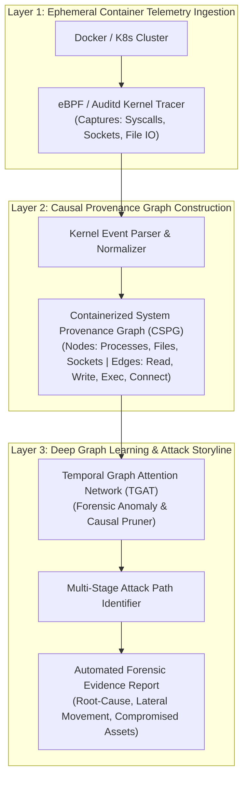

# 🏛️ Topik 01 (Rekomendasi Utama - Cloud & Container Forensics Track)
# Kerangka Kerja Investigasi Forensik Digital Otonom Berbasis Deep Graph Learning untuk Rekonstruksi Jejak Serangan Multi-Tahap pada Lingkungan Cloud Microservices

* **Judul Disertasi (Bahasa Indonesia):**  
  *Kerangka Kerja Investigasi Forensik Digital Otonom Berbasis Deep Graph Learning untuk Rekonstruksi Jejak Serangan Multi-Tahap pada Lingkungan Cloud Microservices*
* **Judul Disertasi (Bahasa Inggris):**  
  *Autonomous Digital Forensics Investigation Framework Based on Deep Graph Learning for Multi-Stage Attack Reconstruction in Cloud Microservices Environments*
* **Klaster Keilmuan:** *Digital Forensics, Cloud Security, Graph Neural Networks, Incident Response*
* **Target Kelulusan:** Program Doktor Ilmu Komputer (PDIK), Universitas Dian Nuswantoro (UDINUS)

---

## 1. Latar Belakang & Motivasi Riset

Transformasi digital skala besar pada instansi pemerintahan (SPBE/IKN) dan industri keuangan telah mengalihkan arsitektur aplikasi ke lingkungan **Cloud-Native Microservices** berbasis kontainer (Docker dan Kubernetes). Namun, karakteristik operasional cloud memunculkan krisis baru dalam bidang **Digital Forensics**:
1. **Sifat Kontainer yang Cepat Hilang (*Ephemeral Nature*):** Ketika serangan siber terjadi (misalnya *container breakout* atau injeksi malware), penyerang dapat menghapus kontainer dalam hitungan detik. Pendekatan forensik tradisional (*dead-box forensics*) yang mengandalkan salinan citra *hard drive* fisik menjadi lumpuh karena tidak ada disk permanen yang tertinggal.
2. **Ledakan Volume Log Audit (*Audit Log Explosion*):** Dalam sistem microservices terdistribusi, jutaan log peristiwa audit sistem (*system calls, network socket flows, IPC*) dihasilkan setiap menit. Penyelidik forensik manusia mengalami *information overload* dalam merekonstruksi alur serangan dari ribuan entri log yang terpisah.
3. **Keterbatasan Rekonstruksi Rantai Serangan (*Attack Provenance Loss*):** Serangan modern umumnya berlangsung dalam beberapa tahap (*multi-stage Advanced Persistent Threat / APT*), bergerak secara lateral antar-kontainer. Diperlukan pemodelan relasi kausalitas antar-proses (*System Provenance Graphs*) yang dapat dianalisis oleh *Graph Neural Networks (GNN)* secara otomatis.

---

## 2. State-of-the-Art (SOTA) Gap & Problem Statement

| Studi Terkait | Metode yang Digunakan | Keterbatasan / Research Gap |
| :--- | :--- | :--- |
| **Traditional Dead-Box Forensics (2018-2022)** | Disk Imaging & Keyword Search | Gagal total pada kontainer cloud tanpa media penyimpanan permanen (*ephemeral*). |
| **Heuristic Provenance Analysis (2021-2024)** | Rule-based Graph Reduction | Sangat rentan terhadap *dependency explosion* dan gagal mendeteksi teknik anti-forensik. |
| **Standard Deep Learning on Logs (2023-2025)** | Sequence Models (LSTM/BERT) | Mengabaikan topologi relasi kausal graf antar-proses dan antar-kontainer. |

**Problem Statement:**  
*Bagaimana merancang kerangka kerja investigasi forensik digital otonom yang mampu mengekstraksi dan memodelkan graf dependensi kausal (System Provenance Graphs) dari telemetri runtime kontainer cloud, serta memanfaatkan Deep Graph Learning untuk merekonstruksi jejak serangan multi-tahap dan mengidentifikasi akar penyebab insiden (root-cause identification) secara presisi?*

---

## 3. Kebaruan Ilmiah (Novelty S3) & Kontribusi Doktoral

1. **Meta-Model Containerized System Provenance Graph (CSPG):**  
   Perancangan skema graf kausalitas waktu-nyata yang memetakan relasi antara *Host OS, Docker Container, System Calls, Process ID, dan Network Sockets* secara efisien tanpa membebani performa produksi (*low-overhead runtime logging*).
2. **Model Deep Graph Learning untuk Reduksi Graf & Deteksi Anomali Forensik:**  
   Pengembangan arsitektur *Temporal Graph Attention Network (TGAT)* yang mampu memfilter 99% *benign event logs* dan hanya menyisakan subgraf kausalitas yang relevan dengan tindakan kriminal siber (*forensic graph reduction*).
3. **Algoritma Rekonstruksi Rantai Serangan Multi-Tahap (Automated Attack Storyline):**  
   Formulasi algoritma penelusuran mundur (*backward provenance tracking*) dan penelusuran maju (*forward impact analysis*) untuk menyusun kronologi insiden hukum (*Chain of Custody*) yang terverifikasi dan dapat dipertanggungjawabkan di pengadilan.

---

## 4. Desain Kerangka Kerja & Alur Komputasi

---

## 5. Target Luaran & Rencana Publikasi Internasional

* **Publikasi Utama 1 (Scopus Q1 - Top Tier):**  
  * *IEEE Transactions on Information Forensics and Security (TIFS)* / *Forensic Science International: Digital Investigation* (Elsevier)
  * Topik: *Autonomous Attack Reconstruction in Ephemeral Cloud Containers Using Temporal Graph Attention Networks.*
* **Publikasi Utama 2 (Scopus Q1/Q2):**  
  * *Computers & Security* (Elsevier) / *IEEE Transactions on Dependable and Secure Computing*
  * Topik: *Causal Provenance Graph Reduction for High-Speed Cloud Forensic Investigations.*
* **Luaran Tambahan:** Framework Open-Source Cloud Forensic Agent & Hak Cipta Perangkat Lunak.

---

## 6. Sinergi dengan Rekam Jejak Pak Hario Jati Setyadi

* **Penguasaan DevOps & CI/CD Docker:** Sangat linear dengan publikasi beliau tahun 2025: *"Perancangan dan Pengembangan Infrastruktur Continuous Integration / Continuos Deployment Menggunakan Jenkins dan Docker"*.
* **Keahlian Penetration Testing & Keamanan Jaringan:** Memperdalam publikasi beliau tentang *Framework ISSAF, Kali Linux, Port Scanning*, dan manajemen jaringan ke ranah keilmuan mutakhir *Cloud-Native Digital Forensics*.
