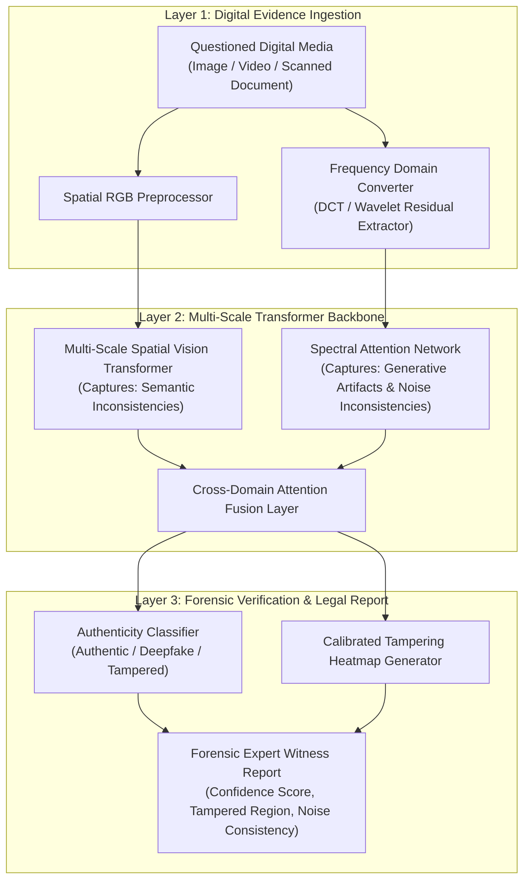

# 🏛️ Topik 02 (Multimedia Forensics & Anti-Forensics Defense Track)
# Deteksi Pemalsuan Bukti Digital dan Rekayasa Deepfake Menggunakan Multi-Scale Vision Transformer dengan Lapisan Explainability Terkalibrasi

* **Judul Disertasi (Bahasa Indonesia):**  
  *Deteksi Pemalsuan Bukti Digital dan Rekayasa Deepfake Menggunakan Multi-Scale Vision Transformer dengan Lapisan Explainability Terkalibrasi*
* **Judul Disertasi (Bahasa Inggris):**  
  *Digital Evidence Forgery and Deepfake Detection Using Multi-Scale Vision Transformers with Calibrated Explainability Layer*
* **Klaster Keilmuan:** *Digital Multimedia Forensics, Computer Vision, Deepfake Detection, Explainable AI*
* **Target Kelulusan:** Program Doktor Ilmu Komputer (PDIK), Universitas Dian Nuswantoro (UDINUS)

---

## 1. Latar Belakang & Motivasi Riset

Kemajuan pesat teknologi *Generative AI* (seperti Diffusion Models, GANs, dan Voice Cloning) telah memungkinkan pembuatan bukti digital palsu (*Deepfakes* dan *Forged Documents/Media*) dengan tingkat realisme yang nyaris sempurna. Dalam penegakan hukum dan investigasi kejahatan siber, hal ini menimbulkan ancaman serius terhadap integritas barang bukti digital:
1. **Kegagalan Deteksi Forensik Standar:** Metode analisis *Error Level Analysis (ELA)* atau deteksi artefak kompresi konvensional tidak lagi mampu mendeteksi manipulasi citra/video yang dihasilkan oleh model generatif generasi terbaru.
2. **Ketiadaan Bukti Hukum yang Dapat Dijelaskan (*Lack of Explainable Forensics*):** Sebagian besar model klasifikasi deep learning hanya menghasilkan skor probabilitas (*0 s/d 1*) tanpa mampu menunjukkan bagian mana dari bukti digital yang telah dimanipulasi secara forensik, sehingga sering ditolak oleh hakim di persidangan.
3. **Teknik Anti-Forensik (*Adversarial Anti-Forensic Attacks*):** Pelaku kejahatan sengaja menambahkan *adversarial perturbation* halus atau melakukan kompresi berulang (*social media recompression*) untuk mengelabui detektor forensik otomatis.

---

## 2. State-of-the-Art (SOTA) Gap & Problem Statement

| Studi Terkait | Metode yang Digunakan | Keterbatasan / Research Gap |
| :--- | :--- | :--- |
| **Traditional Media Forensics (2018-2022)** | ELA, PRNU Sensor Noise Analysis | Gagal pada konten buatan Diffusion Models dan kompresi media sosial. |
| **Standard CNN Classifiers (2021-2024)** | EfficientNet / ResNet pada Deepfake | Rentan terhadap *adversarial noise* dan tidak memiliki penjelasan visual yang terkalibrasi. |
| **Vanilla Vision Transformers (2023-2025)** | ViT Global Patch Attention | Mengabaikan artefak frekuensi spasial tingkat tinggi (*high-frequency spectral noise*). |

**Problem Statement:**  
*Bagaimana merancang kerangka kerja forensik multimedia cerdas berbasis Multi-Scale Vision Transformer dan analisis domain frekuensi spasial yang mampu mendeteksi pemalsuan bukti digital dan deepfake secara akurat, tahan terhadap kompresi berulang, serta menyediakan visualisasi peta manipulasi forensik yang terkalibrasi untuk pembuktian hukum?*

---

## 3. Kebaruan Ilmiah (Novelty S3) & Kontribusi Doktoral

1. **Arsitektur Dual-Domain Spatial-Frequency Vision Transformer:**  
   Penggabungan ekstraksi fitur visual spasial (*RGB pixel domain*) dengan analisis domain frekuensi (*Discrete Cosine Transform / DCT & Wavelet residual noise*) untuk menangkap anomali mikroskopis sintesis generative AI.
2. **Lapisan Visualisasi Forensik Terkalibrasi (*Calibrated Forensic Heatmap Layer*):**  
   Pengembangan mekanisme atensi gradien (*Grad-CAM++ with Uncertainty Calibration*) yang menandai batas manipulasi piksel (*tampering bounding mask*) secara presisi tinggi.
3. **Robustness Protocol terhadap Manipulasi Anti-Forensik:**  
   Pelatihan model dengan *Data Augmentation Pipeline* kompresi bertingkat (WhatsApp, Telegram, Facebook recompression) untuk memastikan bukti digital tetap terdeteksi meski telah tersebar di platform publik.

---

## 4. Desain Kerangka Kerja & Alur Komputasi

---

## 5. Target Luaran & Rencana Publikasi Internasional

* **Publikasi Utama 1 (Scopus Q1):**  
  * *IEEE Transactions on Multimedia* / *IEEE Transactions on Information Forensics and Security*
  * Topik: *Dual-Domain Vision Transformers for Robust Deepfake and Digital Evidence Forgery Detection.*
* **Publikasi Utama 2 (Scopus Q1/Q2):**  
  * *Computers & Security* (Elsevier) / *Journal of Information Security and Applications*
  * Topik: *Explainable Multi-Scale Forensic Verification of Manipulated Digital Media under Heavy Recompression.*
* **Luaran Tambahan:** Software Toolkit Verifikasi Forensik Media Digital & Hak Cipta Perangkat Lunak.

---

## 6. Sinergi dengan Rekam Jejak Pak Hario Jati Setyadi

* **Keahlian Deep Learning & Pattern Recognition:** Sangat linear dengan publikasi terkini beliau dalam pemanfaatan arsitektur *ConvNeXt (2026)* dan *EfficientNet (2024)* untuk klasifikasi citra kompleks.
* **Relevansi Hukum & PkM:** Selaras dengan kegiatan Pengabdian kepada Masyarakat beliau dalam *Edukasi Keamanan Siber dan Perlindungan Informasi Digital Masyarakat*.
