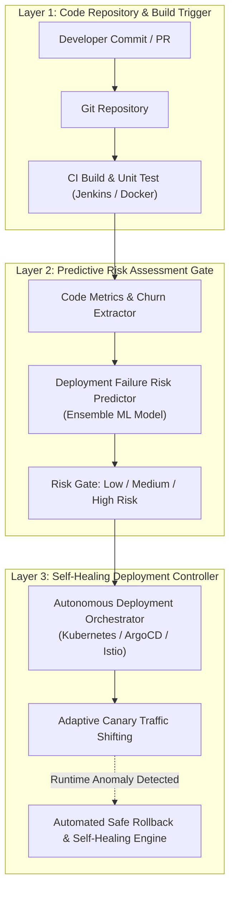

# 🏛️ Topik 02 (DevOps & Cloud Resilience Track)
# Arsitektur Pipa CI/CD Otonom dan Mampu Pulih Mandiri (Self-Healing) Berbasis Pembelajaran Mesin Prediktif untuk Penggelaran Microservices Skala Besar

* **Judul Disertasi (Bahasa Indonesia):**  
  *Arsitektur Pipa CI/CD Otonom dan Mampu Pulih Mandiri (Self-Healing) Berbasis Pembelajaran Mesin Prediktif untuk Penggelaran Microservices Skala Besar*
* **Judul Disertasi (Bahasa Inggris):**  
  *Autonomous and Self-Healing CI/CD Pipeline Architecture Based on Predictive Machine Learning for Large-Scale Microservices Deployment*
* **Klaster Keilmuan:** *Software Engineering, DevOps, Cloud Infrastructure, Autonomous Systems*
* **Target Kelulusan:** Program Doktor Ilmu Komputer (PDIK), Universitas Dian Nuswantoro (UDINUS)

---

## 1. Latar Belakang & Motivasi Riset

Adopsi arsitektur *microservices* dan komputasi awan mendorong frekuensi rilis perangkat lunak menjadi sangat tinggi melalui pipa *Continuous Integration / Continuous Deployment (CI/CD)* (seperti Jenkins, GitLab CI, GitHub Actions, Docker, dan Kubernetes). Namun, frekuensi penggelaran (*deployment*) yang tinggi menimbulkan tantangan baru:
1. **Kegagalan Rilis Tak Terduga di Lingkungan Produksi:** Uji regresi otomatis konvensional sering kali tidak mampu mendeteksi *runtime latency spikes*, *memory leaks*, dan anomali ketergantungan antar-mikroservis sebelum kode dirilis ke lingkungan langsung.
2. **Proses Rollback Manual yang Lambat:** Ketika terjadi insiden pasca-deploy, tim engineer membutuhkan waktu puluhan menit untuk mendeteksi akar masalah (*Root Cause Analysis*) dan memicu *rollback* manual, menyebabkan *downtime* layanan yang merugikan.
3. **Ketiadaan Pembelajaran Prediktif:** Pipa CI/CD industri saat ini bekerja secara deterministik tanpa kemampuan memprediksi risiko kegagalan rilis (*build & deploy failure risk*) berdasarkan metrik perubahan kode (*code churn, test coverage, developer experience, and past commit failures*).

---

## 2. State-of-the-Art (SOTA) Gap & Problem Statement

| Studi Terkait | Metode yang Digunakan | Keterbatasan / Research Gap |
| :--- | :--- | :--- |
| **Traditional CI/CD (2020-2022)** | Scripted Pipelines (Jenkins/Docker) | Statis, tidak memiliki mekanisme mitigasi risiko otonom saat deploy. |
| **Canary Deployment Rule-based (2022-2024)** | Threshold Error-Rate Monitoring | Reaktif, hanya bereaksi setelah puluhan pengguna mengalami error rilis. |
| **Isolated ML Defect Predictors (2023-2025)** | Static Code Analysis Machine Learning | Terpisah dari tahap deployment dan tidak mampu melakukan aksi *runtime self-healing*. |

**Problem Statement:**  
*Bagaimana merancang arsitektur pipa CI/CD cerdas yang mampu memprediksi probabilitas kegagalan penggelaran perangkat lunak secara proaktif, mengorkestrasi pengujian adaptif, serta memicu pemulihan mandiri (self-healing & automated safe rollback) secara otonom pada arsitektur microservices?*

---

## 3. Kebaruan Ilmiah (Novelty S3) & Kontribusi Doktoral

1. **Meta-Model Arsitektur Self-Healing CI/CD Pipeline (SH-CICD):**  
   Perancangan orkestrator pipa CI/CD yang mengintegrasikan lapisan inferensi prediktif (*Predictive Quality Gate*) antara tahap pengujian unit (*build phase*) dan tahap penggelaran (*deployment phase*).
2. **Model Pembelajaran Mesin Prediksi Risiko Rilis Multi-Metrik:**  
   Pengembangan model *Ensemble Gradient Boosting (XGBoost / LightGBM)* yang memproses metrik statis kode, riwayat commit, kompleksitas graf dependensi mikroservis, dan telemetri runtime untuk memprediksi *Deployment Risk Score (DRS)*.
3. **Mekanisme Autonomous Progressive Traffic Shifting & Rollback Engine:**  
   Formulasi algoritma pengalihan trafik bertahap yang secara otomatis menghentikan dan mengembalikan versi kontainer (*zero-downtime automated rollback*) jika anomali latensi mikroservis terdeteksi melampaui ambang batas probabilitas.

---

## 4. Desain Kerangka Kerja & Alur Komputasi

---

## 5. Target Luaran & Rencana Publikasi Internasional

* **Publikasi Utama 1 (Scopus Q1):**  
  * *IEEE Transactions on Software Engineering* / *Journal of Systems and Software* (Elsevier)
  * Topik: *A Predictive and Self-Healing CI/CD Pipeline Architecture for Resilient Microservices Deployment.*
* **Publikasi Utama 2 (Scopus Q1/Q2):**  
  * *Empirical Software Engineering* (Springer) / *IEEE Cloud Computing*
  * Topik: *Machine Learning-Driven Quality Gates for Automated Deployment Failure Mitigation in DevOps Pipelines.*
* **Luaran Tambahan:** Framework Open-Source CI/CD Plugin & Hak Cipta Perangkat Lunak.

---

## 6. Sinergi dengan Rekam Jejak Pak Hario Jati Setyadi

* **Linearitas Publikasi Terkini:** Mengembangkan secara langsung karya ilmiah beliau tahun 2025: *"Perancangan dan Pengembangan Infrastruktur Continuous Integration / Continuos Deployment Menggunakan Jenkins dan Docker"*.
* **Keahlian Jaringan & Keamanan:** Memadukan keahlian beliau dalam *traffic management* jaringan, containerization, dan pengujian penetrasi ke level orkestrasi arsitektur perangkat lunak otomatis.
