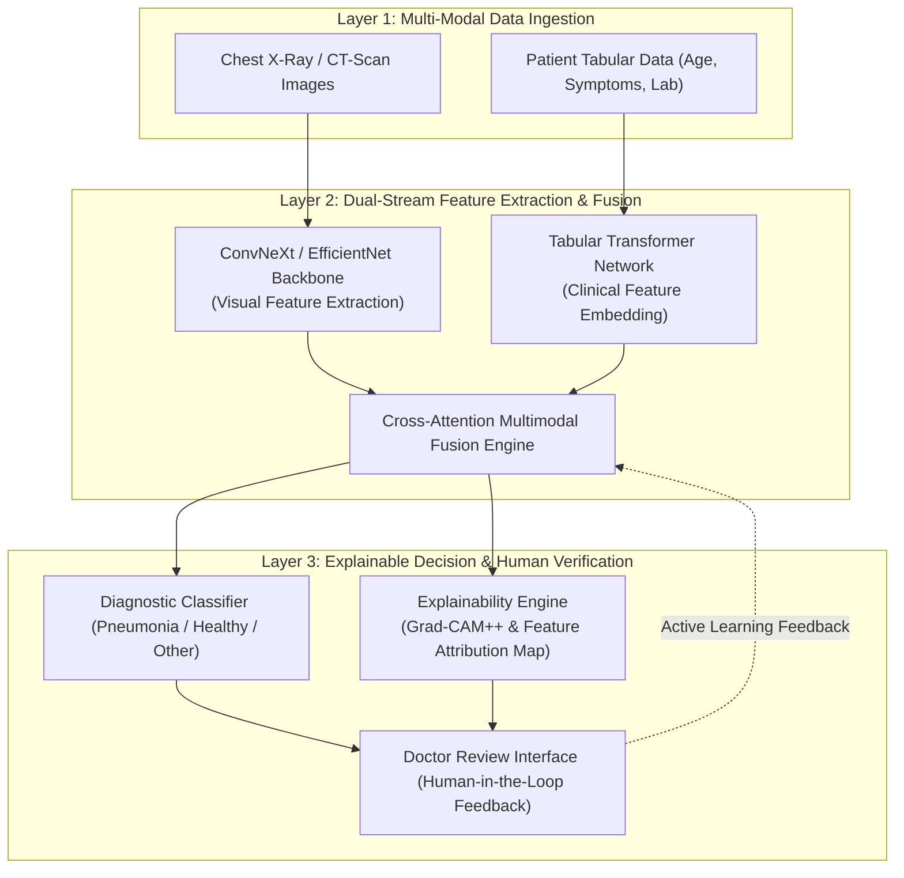

# 🏛️ Topik 03 (Medical AI & Computer Vision Track)
# Kerangka Kerja Diagnostik Medis Multi-Modal Berbasis Deep Learning yang Dapat Dijelaskan (Explainable AI) dengan Dukungan Keputusan Human-in-the-Loop

* **Judul Disertasi (Bahasa Indonesia):**  
  *Kerangka Kerja Diagnostik Medis Multi-Modal Berbasis Deep Learning yang Dapat Dijelaskan (Explainable AI) dengan Dukungan Keputusan Human-in-the-Loop*
* **Judul Disertasi (Bahasa Inggris):**  
  *Explainable Multi-Modal Deep Learning Framework for Medical Diagnostics with Human-in-the-Loop Decision Support*
* **Klaster Keilmuan:** *Medical Informatics, Computer Vision, Explainable AI (XAI), Human-in-the-Loop Systems*
* **Target Kelulusan:** Program Doktor Ilmu Komputer (PDIK), Universitas Dian Nuswantoro (UDINUS)

---

## 1. Latar Belakang & Motivasi Riset

Penerapan *Deep Learning* dalam bidang diagnostik medis (seperti deteksi pneumonia pada rontgen dada dan citra CT-scan paru) telah menunjukkan performa akurasi yang melampaui metode klasifikasi tradisional. Namun, terdapat hambatan besar dalam adopsi klinis nyata di rumah sakit:
1. **Sifat Kotak Hitam (*Black-Box Nature*):** Dokter dan tenaga medis enggan mempercayai prediksi AI yang tidak menyertakan visualisasi alasan klinis di balik keputusannya.
2. **Keterbatasan Analisis Modalitas Tunggal (*Single-Modality Limitation*):** Sebagian besar model AI medis saat ini hanya memproses citra rontgen saja tanpa memperhitungkan data klinis pasien lainnya (seperti usia, riwayat gejala, dan hasil laboratorium darah).
3. **Ketiadaan Mekanisme Koreksi Interaktif (*Human-in-the-Loop*):** Model AI tidak memiliki kemampuan untuk menerima umpan balik koreksi langsung dari dokter spesialis guna menyempurnakan bobot model secara berkelanjutan.

---

## 2. State-of-the-Art (SOTA) Gap & Problem Statement

| Studi Terkait | Metode yang Digunakan | Keterbatasan / Research Gap |
| :--- | :--- | :--- |
| **Standard CNNs (2020-2023)** | ResNet, DenseNet pada X-ray | Hanya modalitas citra, tidak ada penjelasan interpretabilitas klinis. |
| **Post-Hoc XAI (2022-2024)** | Grad-CAM Statis | Sering menghasilkan peta panas (*heatmaps*) yang kabur dan tidak selaras dengan area lesi patologis dokter. |
| **Advanced Vision Architectures (2024-2026)** | ConvNeXt / EfficientNet Medis | Akurasi sangat tinggi tetapi belum terintegrasi dengan data rekam medis tabular (EHR) dan feedback loop dokter. |

**Problem Statement:**  
*Bagaimana merancang kerangka kerja diagnostik medis multi-modal cerdas yang memadukan citra rontgen dada (menggunakan ConvNeXt) dengan data klinis tabular, dilengkapi lapisan Explainable AI berbasis atensi yang dapat diverifikasi dan dikoreksi secara interaktif oleh dokter spesialis (Human-in-the-Loop)?*

---

## 3. Kebaruan Ilmiah (Novelty S3) & Kontribusi Doktoral

1. **Arsitektur Fusi Multi-Modal Cerdas (ConvNeXt + Tabular Transformer):**  
   Pengembangan mekanisme fusi fitur antar-modal (*cross-attention multimodal fusion*) yang menggabungkan representasi visual citra paru dari *ConvNeXt* dengan representasi data rekam medis elektronik (EHR).
2. **Lapisan Interpretabilitas Klinis Terkalibrasi (*Calibrated Clinical XAI Layer*):**  
   Formulasi visualisasi atensi yang menghasilkan *Pathology Bounding Map* presisi tinggi, memungkinkan dokter melihat persentase kontribusi setiap biomarker klinis terhadap hasil diagnosis.
3. **Mekanisme Umpan Balik Interaktif Dokter (*Active Learning Human-in-the-Loop*):**  
   Protokol adaptasi model yang memungkinkan koreksi anotasi oleh dokter spesialis langsung masuk ke dalam *incremental fine-tuning pipeline* secara aman.

---

## 4. Desain Kerangka Kerja & Alur Komputasi

---

## 5. Target Luaran & Rencana Publikasi Internasional

* **Publikasi Utama 1 (Scopus Q1):**  
  * *IEEE Journal of Biomedical and Health Informatics (JBHI)* / *Artificial Intelligence in Medicine*
  * Topik: *Explainable Multi-Modal Deep Learning for Pulmonary Disease Diagnostics with Human-in-the-Loop Verification.*
* **Publikasi Utama 2 (Scopus Q1/Q2):**  
  * *Computers in Biology and Medicine* (Elsevier) / *Journal of Healthcare Informatics Research*
  * Topik: *Cross-Attention ConvNeXt and Clinical Feature Fusion for Transparent Medical Decision Support Systems.*
* **Luaran Tambahan:** Modul Software Diagnostik Medis & Hak Cipta Algoritma XAI.

---

## 6. Sinergi dengan Rekam Jejak Pak Hario Jati Setyadi

* **Linearitas Publikasi Terkini (2024–2026):** Melanjutkan langsung publikasi beliau tahun 2026: *"Deep Learning Methods for Pneumonia Detection Using ConvNeXt Architecture"* dan tahun 2024: *"Klasifikasi COVID 19 dengan Metode EfficientNet berdasarkan CT scan Paru-paru"*.
* **Peningkatan ke Level Doktoral:** Menjawab kritik utama riset AI medis mengenai ketiadaan *explainability* dan integrasi data klinis riil.
