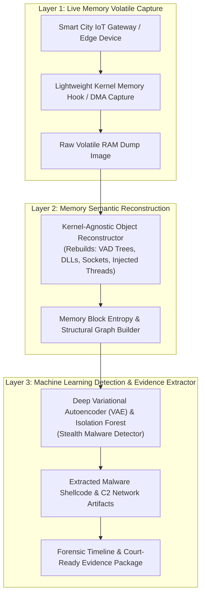

# 🏛️ Topik 03 (Live Memory & IoT Malware Forensics Track)
# Analisis Forensik Memori Volatil (Live Memory Forensics) Berbasis Pembelajaran Mesin untuk Ekstraksi Bukti Malware Tersembunyi pada Perangkat IoT Smart City

* **Judul Disertasi (Bahasa Indonesia):**  
  *Analisis Forensik Memori Volatil (Live Memory Forensics) Berbasis Pembelajaran Mesin untuk Ekstraksi Bukti Malware Tersembunyi pada Perangkat IoT Smart City*
* **Judul Disertasi (Bahasa Inggris):**  
  *Volatile Memory Forensics Framework Based on Machine Learning for Stealth Malware Evidence Extraction in Smart City IoT Devices*
* **Klaster Keilmuan:** *Memory Forensics, IoT Security, Malware Analysis, Machine Learning*
* **Target Kelulusan:** Program Doktor Ilmu Komputer (PDIK), Universitas Dian Nuswantoro (UDINUS)

---

## 1. Latar Belakang & Motivasi Riset

Pembangunan infrastruktur *Smart City* dan tata kelola cerdas di Indonesia (termasuk proyek strategis Ibu Kota Nusantara / IKN di Kalimantan Timur) melibatkan ribuan perangkat *Internet of Things (IoT)* dan *edge gateways*. Lingkungan ini menjadi target utama serangan siber tingkat lanjut:
1. **Penyebaran *Fileless Malware* & Injeksi Kode Memori:** Malware modern pada IoT tidak lagi menyimpan berkas eksekusi pada media penyimpanan flash/disk (*diskless malware*), melainkan beroperasi murni di dalam memori kerja (*volatile RAM*) atau menyuntikkan kode berbahaya ke dalam proses sah (*process hollowing/code injection*).
2. **Keterbatasan Akuisisi Forensik Statis:** Mematikan atau melakukan *reboot* pada perangkat IoT secara otomatis menghapus seluruh jejak memori volatil (*loss of volatile evidence*), sehingga teknik forensik disk konvensional tidak berguna.
3. **Keterbatasan Sumber Daya Komputasi IoT (*Resource Constraints*):** Perangkat IoT memiliki kapasitas RAM dan CPU yang terbatas, sehingga agen akuisisi dan analisis forensik memori harus sangat efisien (*ultra-lightweight memory dumping*).

---

## 2. State-of-the-Art (SOTA) Gap & Problem Statement

| Studi Terkait | Metode yang Digunakan | Keterbatasan / Research Gap |
| :--- | :--- | :--- |
| **Traditional Volatility Plugins (2018-2022)** | Signature-based Memory Parsing | Lambat, bergantung pada profil kernel statis yang kaku, gagal pada varian malware polimorfik. |
| **Static Firmware Analysis (2020-2023)** | Binary Disassembly & Ghidra | Hanya menganalisis firmware statis, tidak mampu mendeteksi payload yang diinjeksikan saat runtime. |
| **Standard ML Memory Classifiers (2023-2025)** | Byte-Entropy Features | Tingkat positif palsu (*false positive rate*) tinggi terhadap kompresi memori OS normal. |

**Problem Statement:**  
*Bagaimana merancang kerangka kerja forensik memori volatil (Live Memory Forensics) yang ringan dan cerdas untuk mengekstraksi struktur objek kernel dan mendeteksi jejak malware tersembunyi (fileless malware & code injection) pada lingkungan memori IoT tanpa mengganggu kontinuitas layanan?*

---

## 3. Kebaruan Ilmiah (Novelty S3) & Kontribusi Doktoral

1. **Model Akuisisi Memori Berbobot Ringan Bebas Profil Kernel (*Kernel-Agnostic Memory Extractor*):**  
   Pengembangan mekanisme inspeksi memori volatil yang mampu mengenali struktur data proses (*task_struct / process control blocks*) secara dinamis tanpa bergantung pada simbol debug kernel OS.
2. **Arsitektur Deep Autoencoder untuk Isolasi Anomali Memori Tersembunyi:**  
   Penggunaan model *Deep Variational Autoencoder (VAE)* yang dilatih pada profil alokasi memori normal, sehingga mampu mengisolasi blok memori asing yang diinjeksi malware dengan presisi tinggi.
3. **Framework Forensik Bukti Kausalitas Terdistribusi IoT:**  
   Protokol penelusuran relasi memori antar-node IoT (*Inter-Device Memory Correlation*) untuk melacak asal-usul penyusupan jaringan (*initial compromise point*).

---

## 4. Desain Kerangka Kerja & Alur Komputasi

---

## 5. Target Luaran & Rencana Publikasi Internasional

* **Publikasi Utama 1 (Scopus Q1):**  
  * *IEEE Internet of Things Journal* / *Forensic Science International: Digital Investigation*
  * Topik: *Kernel-Agnostic Volatile Memory Forensics for Stealth Malware Detection in Smart City IoT Gateways.*
* **Publikasi Utama 2 (Scopus Q1/Q2):**  
  * *Journal of Information Security and Applications* (Elsevier) / *IEEE Transactions on Network and Service Management*
  * Topik: *Deep Autoencoder-Driven Process Memory Carving for Embedded System Incident Response.*
* **Luaran Tambahan:** Open-Source Memory Forensics Plugin untuk IoT & Hak Cipta Perangkat Lunak.

---

## 6. Sinergi dengan Rekam Jejak Pak Hario Jati Setyadi

* **Keahlian Jaringan & Monitoring Lalu Lintas:** Selaras dengan riset beliau tentang *Network Traffic WLAN Monitoring based SNMP using MRTG* dan pengujian penetrasi server.
* **Konteks Smart City Kaltim / IKN:** Memberikan dampak aplikatif nyata untuk pengamanan infrastruktur cerdas di Kalimantan Timur.
