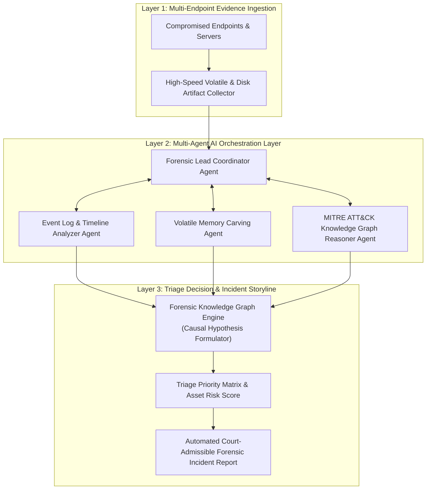

# 🏛️ Topik 04 (Automated Forensic Triage & Multi-Agent Track)
# Sistem Triage Forensik Digital Cerdas Berbasis Autonomous Multi-Agent Systems dan Graph Knowledge Reasoning untuk Penanganan Insiden Keamanan Siber Skala Besar

* **Judul Disertasi (Bahasa Indonesia):**  
  *Sistem Triage Forensik Digital Cerdas Berbasis Autonomous Multi-Agent Systems dan Graph Knowledge Reasoning untuk Penanganan Insiden Keamanan Siber Skala Besar*
* **Judul Disertasi (Bahasa Inggris):**  
  *Intelligent Digital Forensic Triage System Based on Autonomous Multi-Agent Systems and Knowledge Graph Reasoning for Large-Scale Incident Response*
* **Klaster Keilmuan:** *Digital Forensic Triage, Multi-Agent Systems, Knowledge Graphs, Incident Response*
* **Target Kelulusan:** Program Doktor Ilmu Komputer (PDIK), Universitas Dian Nuswantoro (UDINUS)

---

## 1. Latar Belakang & Motivasi Riset

Pada serangan siber skala enterprise (seperti serangan *Ransomware* atau kebocoran data massal di instansi pemerintah), tim penyidik forensik (*Incident Response / CSIRT*) dihadapkan pada ratusan perangkat yang terinfeksi secara bersamaan. Diperlukan proses **Forensic Triage**—yaitu penentuan prioritas bukti dan penyortiran barang bukti digital yang kritis dalam hitungan menit pertama setelah insiden.

Namun, proses triage forensik saat ini menghadapi hambatan besar:
1. **Ketergantungan Ekstrem pada Tenaga Ahli Manusia:** Investigasi forensik manual membutuhkan waktu berhari-hari untuk memilah disk image, log firewall, dan memori dari puluhan workstation, sementara penyerang terus memperluas kerusakan.
2. **Ketiadaan Penalaran Terstruktur (*Lack of Knowledge Reasoning*):** Alat bantu triage otomatis saat ini hanya mencocokkan *hash* berkas (IoC statis) tanpa mampu melakukan inferensi korelasi antara taktik, teknik, dan prosedur penyerang (*MITRE ATT&CK Framework*).
3. **Peluang Orkestrasi Autonomous AI Agents:** Integrasi sistem agen kecerdasan buatan terdistribusi (*Multi-Agent Systems*) yang dapat bekerja paralel untuk mengekstraksi artefak, memvalidasi bukti, dan menyusun hipotesis forensik menyajikan terobosan baru dalam efisiensi investigasi.

---

## 2. State-of-the-Art (SOTA) Gap & Problem Statement

| Studi Terkait | Metode yang Digunakan | Keterbatasan / Research Gap |
| :--- | :--- | :--- |
| **Manual Forensic Triage (2018-2022)** | Scripted Artifact Collector (KAPE/Velociraptor) | Hanya mengumpulkan file tanpa analisis korelasi ancaman cerdas. |
| **Rule-Based SIEM Correlators (2021-2024)** | Correlation Rules / Sigma Rules | Menghasilkan ribuan alarm palsu (*alert fatigue*) tanpa sintesis cerita insiden. |
| **Single-LLM Forensic Assistants (2024-2026)** | Single Prompt Large Language Models | Sering mengalami halusinasi dan tidak dapat memverifikasi integritas bukti hukum (*chain of custody*). |

**Problem Statement:**  
*Bagaimana merancang arsitektur sistem triage forensik digital cerdas berbasis Multi-Agent Systems yang berkolaborasi secara otonom untuk memilah, menganalisis, dan merekonstruksi insiden siber secara paralel menggunakan Knowledge Graph Reasoning yang terverifikasi?*

---

## 3. Kebaruan Ilmiah (Novelty S3) & Kontribusi Doktoral

1. **Meta-Model Multi-Agent Collaborative Forensic Triage (MAC-FT):**  
   Perancangan sistem agen otonom terdistribusi dengan peran khusus: (a) *Artifact Harvester Agent*, (b) *Timeline Reconstruction Agent*, (c) *Threat Intelligence Matching Agent*, dan (d) *Forensic Lead Investigator Agent*.
2. **Knowledge Graph Kausalitas Forensik (Forensic Knowledge Graph - FKG):**  
   Pengembangan skema graf pengetahuan yang memetakan bukti artefak mentah (*prefetch, event logs, MFT, registry*) ke taktik *MITRE ATT&CK* untuk melakukan inferensi kausalitas insiden secara otomatis.
3. **Mekanisme Verifikasi Integritas Rantai Bukti Otonom (*Autonomous Chain of Custody Guardian*):**  
   Protokol penandatanganan kriptografis bukti digital secara otomatis pada setiap langkah penalaran agen untuk menjamin keabsahan hukum di pengadilan (*admissible in court*).

---

## 4. Desain Kerangka Kerja & Alur Komputasi

---

## 5. Target Luaran & Rencana Publikasi Internasional

* **Publikasi Utama 1 (Scopus Q1):**  
  * *Expert Systems with Applications* / *IEEE Transactions on Information Forensics and Security*
  * Topik: *Autonomous Multi-Agent Collaboration for Automated Forensic Triage and Attack Storyline Reconstruction.*
* **Publikasi Utama 2 (Scopus Q1/Q2):**  
  * *Forensic Science International: Digital Investigation* / *Computers & Security*
  * Topik: *Knowledge Graph Reasoning for High-Confidence Digital Forensic Incident Triage.*
* **Luaran Tambahan:** Framework Open-Source Multi-Agent Forensic Triage & Hak Cipta Perangkat Lunak.

---

## 6. Sinergi dengan Rekam Jejak Pak Hario Jati Setyadi

* **Keahlian AI Agents Terkini (2026):** Sangat linear dengan publikasi terbaru beliau: *"Penerapan AI Agent Berbasis n8n untuk Otomatisasi Operasional"*.
* **Peran Ketua APTIKOM Kaltim:** Solusi triage otomatis ini sangat bernilai untuk penanganan insiden siber pada instansi pemerintah dan perguruan tinggi se-Kalimantan Timur.
