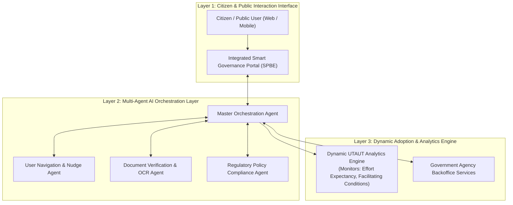

# 🏛️ Topik 04 (Smart Governance & Multi-Agent Track)
# Model Kerangka Kerja Adopsi Sistem Informasi Cerdas Berbasis AI Agent dan Teori Respon Dinamis untuk Layanan Publik Terintegrasi

* **Judul Disertasi (Bahasa Indonesia):**  
  *Model Kerangka Kerja Adopsi Sistem Informasi Cerdas Berbasis AI Agent dan Teori Respon Dinamis untuk Layanan Publik Terintegrasi*
* **Judul Disertasi (Bahasa Inggris):**  
  *Intelligent Information System Adoption Framework Based on AI Agents and Dynamic Response Theory for Integrated Public Services*
* **Klaster Keilmuan:** *E-Government, Multi-Agent Systems, Information Systems Adoption, Smart Governance*
* **Target Kelulusan:** Program Doktor Ilmu Komputer (PDIK), Universitas Dian Nuswantoro (UDINUS)

---

## 1. Latar Belakang & Motivasi Riset

Pembangunan ekosistem *Smart Governance* di Indonesia, khususnya dalam konteks transformasi digital nasional dan Ibu Kota Nusantara (IKN) di Kalimantan Timur, menghadapi tantangan besar terkait adopsi dan retensi pengguna pada platform layanan publik terpadu (seperti portal SPBE dan aplikasi satu data).

Meskipun model adopsi sistem informasi (seperti UTAUT, TAM, dan DeLone & McLean) telah banyak digunakan untuk mengevaluasi adopsi sistem, terdapat kelemahan krusial:
1. **Model Adopsi Bersifat Statis & Pasif:** Model adopsi tradisional hanya memetakan faktor penerimaan (*Acceptance Factors*) melalui survei pasca-penggunaan tanpa mampu melakukan tindakan intervensi otomatis ketika terjadi resistensi atau kebingungan pengguna.
2. **Ketiadaan Asistensi Cerdas yang Kontekstual:** Pengguna layanan publik sering kali meninggalkan proses transaksi (*drop-off rate* tinggi) karena alur birokrasi aplikasi yang panjang dan tidak adanya panduan adaptif.
3. **Peluang Orkestrasi Autonomous AI Agents:** Integrasi sistem agen otonom (*Multi-Agent Systems*) yang mampu memandu pengguna, memvalidasi kelengkapan dokumen otomatis, dan memprediksi kepuasan layanan secara dinamis dapat mengubah paradigma adopsi sistem informasi menjadi proaktif dan cerdas.

---

## 2. State-of-the-Art (SOTA) Gap & Problem Statement

| Studi Terkait | Metode yang Digunakan | Keterbatasan / Research Gap |
| :--- | :--- | :--- |
| **Traditional UTAUT/TAM (2018-2023)** | Structural Equation Modeling (PLS-SEM) | Hanya bersifat diagnostik statis, tidak ada intervensi sistem cerdas saat runtime. |
| **Simple Chatbot E-Gov (2021-2024)** | Rule-Based FAQ Chatbots | Terisolasi dari basis data transaksi, tidak dapat menyelesaikan proses birokrasi secara otonom. |
| **Emerging AI Agents (2025-2026)** | Single-Agent Automations (n8n/LLM) | Belum memiliki kerangka kerja teoritis formal mengenai dampaknya terhadap adopsi dan kepuasan pengguna (*User Acceptance Dynamics*). |

**Problem Statement:**  
*Bagaimana merancang kerangka kerja sistem informasi cerdas berbasis orkestrasi Multi-AI Agent yang mampu melakukan asistensi proaktif, otomatisasi alur layanan publik terpadu, dan meningkatkan indeks adopsi pengguna secara dinamis dan terukur?*

---

## 3. Kebaruan Ilmiah (Novelty S3) & Kontribusi Doktoral

1. **Meta-Model Dynamic Adoption Engine (DAE):**  
   Pengembangan kerangka kerja teoretis dan komputasional yang mengintegrasikan teori UTAUT-2 dengan orkestrasi *Multi-Agent AI* untuk memprediksi dan memitigasi *user churn* pada layanan publik.
2. **Arsitektur Multi-Agent Collaboration untuk Layanan Publik Terintegrasi:**  
   Perancangan sistem agen otonom terdistribusi yang terdiri dari: (a) *User Navigator Agent*, (b) *Document Verifier Agent*, (c) *Policy Compliance Agent*, dan (d) *Feedback Analytics Agent*.
3. **Mekanisme Adaptasi Intervensi Proaktif (*Proactive Nudging Engine*):**  
   Formulasi algoritma pembelajaran yang secara otomatis memberikan asistensi langkah atau rekomendasi simplifikasi dokumen saat mendeteksi keraguan atau kesalahan input pengguna.

---

## 4. Desain Kerangka Kerja & Alur Komputasi

---

## 5. Target Luaran & Rencana Publikasi Internasional

* **Publikasi Utama 1 (Scopus Q1):**  
  * *Government Information Quarterly* (Elsevier) / *Information Systems Frontiers* (Springer)
  * Topik: *An Intelligent Multi-Agent Framework for Transforming User Adoption in Integrated E-Government Services.*
* **Publikasi Utama 2 (Scopus Q1/Q2):**  
  * *Electronic Commerce Research and Applications* / *Computers in Human Behavior*
  * Topik: *Dynamic Public Service Nudging: Integrating Multi-Agent AI Systems with Technology Acceptance Models.*
* **Luaran Tambahan:** Framework Open-Source AI Agent Orchestrator untuk SPBE & Hak Cipta Perangkat Lunak.

---

## 6. Sinergi dengan Rekam Jejak Pak Hario Jati Setyadi

* **Linearitas Publikasi Fundamental & Terkini:** Mengawinkan publikasi bereputasi beliau di *Procedia Computer Science* mengenai *UTAUT Adoption (48 sitasi)* dengan publikasi terbarunya tahun 2026 mengenai *AI Agent berbasis n8n untuk otomatisasi operasional*.
* **Peran Kepemimpinan Akademik:** Sebagai Ketua APTIKOM Kaltim, topik ini memberikan kontribusi nyata bagi standardisasi dan percepatan transformasi digital instansi pemerintahan daerah di Kalimantan Timur dan IKN.
