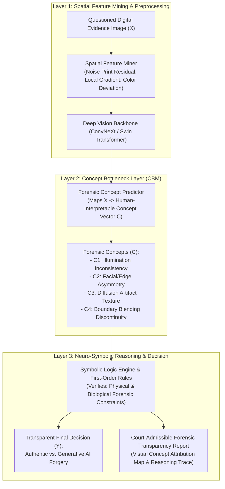

# 🏆 TOPIK PILIHAN DEFINITIF KANDIDAT DOKTOR
# Arsitektur Neuro-Symbolic Concept Bottleneck Berbasis Spatial Feature Mining untuk Deteksi dan Transparansi Bukti Digital Gambar Generatif AI

* **Kandidat Calon Doktor:** Hario Jati Setyadi, S.Kom., M.Kom.
* **Judul Disertasi (Bahasa Indonesia):**  
  *Arsitektur Neuro-Symbolic Concept Bottleneck Berbasis Spatial Feature Mining untuk Deteksi dan Transparansi Bukti Digital Gambar Generatif AI*
* **Judul Disertasi (Bahasa Inggris):**  
  *Neuro-Symbolic Concept Bottleneck Architecture Based on Spatial Feature Mining for Detection and Transparency of Generative AI Digital Image Evidence*
* **Program Studi Tujuan:** Program Doktor Ilmu Komputer (PDIK), Universitas Dian Nuswantoro (UDINUS)
* **Klaster Keilmuan:** *Digital Forensics, Explainable AI (XAI), Computer Vision, & Neuro-Symbolic Reasoning*

---

## 🎯 1. Mengapa Topik Ini Merupakan Pilihan Terbaik (*The Perfect Fit*)?

Pilihan Pak Hario untuk mengangkat judul ini adalah **keputusan ilmiah paling tepat dan sangat kuat (*strong academic justification*)**:

1. **Mengatasi Isu "Kotak Hitam" AI di Pengadilan Hukum (*Court-Admissible AI*):**  
   Dalam hukum pidana (KUHAP & UU ITE), hakim tidak bisa menerima vonis pemalsuan bukti digital hanya berdasarkan skor probabilitas "Palsu 99%" dari deep learning biasa. Arsitektur **Concept Bottleneck Model (CBM)** membedah anomali gambar ke dalam konsep-konsep fisik yang dapat dipahami manusia (seperti arah pencahayaan, konsistensi bayangan, dan simetri kornea mata).
2. **Kombinasi Mutakhir Neuro-Symbolic AI:**  
   Mengawinkan ketajaman ekstraksi pola visual neural network dengan ketepatan penalaran aturan logika deduktif (*First-Order Logic Constraints*).
3. **Ketahanan terhadap Kompresi (*Spatial Feature Mining*):**  
   Menambang residu derau frekuensi spasial (*noise print residuals*) sehingga deteksi tetap akurat meskipun gambar telah tersebar dan dikompresi di WhatsApp, Telegram, atau media sosial.

---

## 🏗️ 2. Desain Arsitektur & Alur Komputasi Tiga Lapis

---

## 📑 3. Target Publikasi Bereputasi Scopus Q1

* **Publikasi Utama 1 (Scopus Q1 Top-Tier):**  
  * *IEEE Transactions on Information Forensics and Security (TIFS)* / *IEEE Transactions on Multimedia (TMM)*
  * Topik: *Neuro-Symbolic Concept Bottleneck Models for Transparent and Court-Admissible Deepfake Evidence Detection.*
* **Publikasi Utama 2 (Scopus Q1/Q2):**  
  * *Forensic Science International: Digital Investigation* (Elsevier) / *Computers & Security*
  * Topik: *Spatial Feature Mining and Robust Concept Attribution for Generative AI Image Authentication under Social Media Recompression.*
* **Luaran Tambahan:** Software Engine Verifikasi Forensik Gambar Generatif AI & Hak Cipta Perangkat Lunak.
