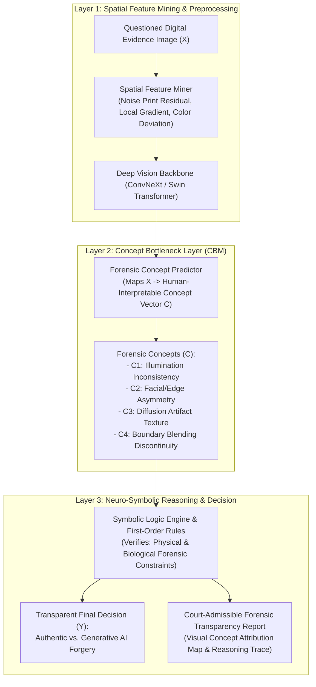

# RENCANA PROPOSAL DISERTASI DOKTORAL (NASKAH DEFINITIF)
## PROGRAM DOKTOR ILMU KOMPUTER (PDIK)
### FAKULTAS ILMU KOMPUTER - UNIVERSITAS DIAN NUSWANTORO

---

### **JUDUL PENELITIAN DISERTASI (BAHASA INDONESIA):**
# **Arsitektur Neuro-Symbolic Concept Bottleneck Berbasis Spatial Feature Mining untuk Deteksi dan Transparansi Bukti Digital Gambar Generatif AI**

### **RESEARCH DISSERTATION TITLE (ENGLISH):**
# **Neuro-Symbolic Concept Bottleneck Architecture Based on Spatial Feature Mining for Detection and Transparency of Generative AI Digital Image Evidence**

---

### **DATA CALON PENELITI DOKTOR:**
* **Nama Lengkap:** Hario Jati Setyadi, S.Kom., M.Kom.
* **Nomor Induk Pegawai (NIP):** 198612182019031007
* **Nomor Induk Dosen Nasional (NIDN):** 0018128604
* **Pangkat / Golongan / Jabatan:** Penata Tk. I / III/d / Lektor
* **Institusi Asal:** Universitas Mulawarman (UNMUL), Samarinda, Kalimantan Timur
* **Fakultas / Program Studi:** Fakultas Teknik / S1 Sistem Informasi & S1 Informatika
* **Jabatan Organisasi Profesi:** **Ketua APTIKOM (Asosiasi Pendidikan Tinggi Informatika dan Komputer) Provinsi Kalimantan Timur (Periode 2026–2030)**
* **Jabatan Struktural Kampus:** Sekretaris Program Studi S1 Sistem Informasi FT UNMUL
* **Pendidikan S2:** Magister Teknik Informatika (MTI) Konsentrasi Sistem Informasi, Institut Teknologi Sepuluh Nopember (ITS) Surabaya
* **Bidang Minat / Peminatan PDIK:** *Digital Forensics, Applied Artificial Intelligence, & Computer Vision*
* **Rekam Jejak Akademik:** SINTA ID: **6654665** | Scopus Author ID: **57201347811** (h-index: 10, 89+ Publikasi, 340+ Sitasi Global)

---

## 1. LATAR BELAKANG MASALAH

Evolusi pesat teknologi *Generative Artificial Intelligence*—khususnya arsitektur *Latent Diffusion Models* (seperti Stable Diffusion, Midjourney, DALL-E 3) dan *Generative Adversarial Networks (GANs)*—telah mencapai kemampuan sintesis citra digital dengan tingkat fotorealisme yang sangat tinggi. Dalam ranah penegakan hukum, keamanan siber, dan peradilan pidana/perdata, fenomena ini melahirkan krisis kepercayaan yang masif terhadap **keabsahan barang bukti digital (*Digital Evidence Integrity Crisis*)**.

Gambar rekayasa AI kini digunakan secara luas untuk pemalsuan dokumen hukum, manipulasi bukti kejahatan di tempat kejadian perkara (TKP), penipuan identitas (*identity fraud*), hingga rekayasa pornografi non-konsensual (*deepfakes*). Namun, sistem deteksi pemalsuan citra berbasis *Deep Learning* konvensional saat ini menghadapi tiga hambatan fundamental:

1. **Masalah "Kotak Hitam" (*The Black-Box Opacity Problem*):**  
   Model deteksi deep learning standar (seperti ResNet, EfficientNet, Vision Transformer) memetakan citra piksel langsung ke probabilitas biner ($\text{Citra} \rightarrow \text{Palsu/Asli}$). Ketika model memberikan klasifikasi "Palsu (99%)", sistem tidak mampu menjelaskan konsep fisik atau anomali forensik apa yang mendasari keputusan tersebut. Hal ini bertentangan dengan prinsip pembuktian hukum pidana (KUHAP Pasal 184 / UU ITE Pasal 5 dan 6), di mana barang bukti digital wajib memiliki rantai penjelasan ilmiah yang dapat diuji oleh saksi ahli di persidangan (*court-admissible explanation*).
2. **Kegagalan Generalisasi pada Domain Spasial Frekuensi Tinggi (*Spatial Feature Inconsistency*):**  
   Model generatif modern menyisakan anomali mikroskopis pada domain spasial, seperti diskontinuitas pola tekstur kulit, inkonsistensi bayangan pencahayaan (*illumination gradients*), serta distorsi spektral frekuensi tinggi (*noise print residual*). Metode *feature extraction* konvensional sering kali mengaburkan sinyal-sinyal forensik halus ini, terutama saat citra mengalami kompresi berulang di platform media sosial.
3. **Ketiadaan Integrasi Aturan Logika Forensik (*Lack of Symbolic Domain Knowledge*):**  
   Penyelidik forensik manusia menggunakan aturan penalaran deduktif berbasis hukum fisika dan biologi (misalnya: simetri pantulan kornea mata, konsistensi arah sumber cahaya, dan kontinuitas batas tepi objek). Deep learning murni tidak memiliki pemahaman simbolik tersebut, sehingga rentan mengalami *hallucination* atau manipulasi *anti-forensics adversarial noise*.

Untuk mengatasi ketiga tantangan kritis tersebut, penelitian disertasi ini mengusulkan **Arsitektur Neuro-Symbolic Concept Bottleneck Berbasis Spatial Feature Mining**. Pendekatan ini secara revolusioner menyisipkan lapisan konsep forensik yang dapat dipahami manusia (*Human-Interpretable Concept Layer*) di tengah arsitektur neural network ($\mathbf{X} \rightarrow \mathbf{C} \rightarrow \mathbf{y}$), lalu menerapkan mesin penalaran simbolik (*Symbolic Logic Engine*) untuk memverifikasi keabsahan bukti digital secara transparan, akurat, dan dapat dipertanggungjawabkan di hadapan hukum.

---

## 2. PERUMUSAN MASALAH

Berdasarkan latar belakang di atas, rumusan masalah dalam penelitian disertasi ini adalah:
1. Bagaimana merancang mekanisme *Spatial Feature Mining* yang mampu mengekstraksi artefak mikroskopis, residu difusi generatif, dan inkonsistensi pencahayaan pada citra bukti digital secara robust terhadap kompresi?
2. Bagaimana memformulasikan arsitektur *Concept Bottleneck Model (CBM)* yang memetakan fitur spasial tingkat rendah menjadi kumpulan konsep forensik terstandarisasi (*forensic semantic concepts*) yang dapat dipahami oleh pakar hukum dan penyelidik forensik?
3. Bagaimana mengintegrasikan lapisan penalaran *Neuro-Symbolic Reasoning* berbasis logika orde pertama (*First-Order Logic*) untuk memvalidasi hubungan antar-konsep forensik dan menghasilkan keputusan klasifikasi yang 100% transparan serta memiliki rantai keterbukaan bukti (*Chain of Explainability*)?

---

## 3. BATASAN MASALAH

1. Objek penelitian difokuskan pada bukti digital citra diam (*still digital images*) yang dihasilkan atau dimanipulasi oleh model AI Generatif mutakhir (Diffusion Models dan GANs).
2. Konsep forensik (*forensic concepts*) yang diekstraksi mencakup: (a) *Illumination Direction Inconsistency*, (b) *Facial/Object Symmetry Anomaly*, (c) *Diffusion Texture Noise Residual*, (d) *Edge Blending Discontinuity*, dan (e) *Color Constancy Deviation*.
3. Kerangka kerja dirancang untuk menghasilkan visualisasi *concept-attribution map* dan laporan forensik terstruktur berstandar ISO/IEC 27037 (Pedoman Penanganan Alat Bukti Digital).
4. Evaluasi kinerja mencakup metrik *Detection Accuracy/AUC-ROC*, *Concept Prediction F1-Score*, *Robustness under Social Media Recompression (JPEG QF 50-90)*, dan *Human Expert Trust & Interpretability Score*.

---

## 4. TUJUAN PENELITIAN

1. Mengembangkan teknik **Spatial Feature Mining** berbasis ekstraksi multi-skala spasial dan frekuensi residual untuk menangkap sidik jari artefak generatif AI (*generative noise prints*).
2. Membangun **Arsitektur Neuro-Symbolic Concept Bottleneck Model (NS-CBM)** yang mengonversi representasi sub-simbolik neural network menjadi konsep forensik semantik yang transparan.
3. Merumuskan **Mesin Penalaran Simbolik Berbasis Aturan Forensik (*Symbolic Logic Reasoning Engine*)** untuk memverifikasi konsistensi relasi kausalitas antar-konsep bukti digital.
4. Menghasilkan **Kerangka Kerja Forensik Terintegrasi** yang siap diimplementasikan oleh aparat penegak hukum (Polri/CSIRT/Kejaksaan) untuk pengujian bukti digital di persidangan.

---

## 5. MANFAAT PENELITIAN

### A. Manfaat Teoretis (Keilmuan S3 Ilmu Komputer):
* Menghadirkan paradigma baru dalam domain *Explainable Artificial Intelligence (XAI)* dan *Digital Forensics* dengan memadukan kekuatan representasi *Deep Learning* dan ketelitian deduktif *Symbolic AI* melalui *Concept Bottleneck Models*.

### B. Manfaat Praktis & Kebijakan Publik:
* Memberikan instrumen ilmiah yang valid bagi Kepolisian, Lembaga Forensik Digital, dan Pengadilan di Indonesia dalam membedakan bukti digital asli vs hasil rekayasa Generative AI demi menegakkan keadilan hukum di era transformasi digital dan IKN.

---

## 6. TINJAUAN PUSTAKA & STATE OF THE ART (SOTA)

### Tabel Komparasi Penelitian Terdahulu (2021–2026)

| Peneliti & Tahun | Metode / Pendekatan | Kelebihan | Keterbatasan / Research Gap | Posisi Penelitian Ini |
| :--- | :--- | :--- | :--- | :--- |
| **Koh et al. (2020) / Marconato et al. (2022)** | Concept Bottleneck Models (CBM) pada Citra Umum | Transparansi tinggi melalui prediksi konsep intermediet. | Belum pernah diterapkan pada domain Digital Forensik dan manipulasi Generatif AI. | Mengadaptasi CBM ke domain bukti digital dengan konsep forensik terkalibrasi. |
| **Wang et al. (2023) / Corvi et al. (2023)** | Deep Learning Detection for Diffusion Images | Akurasi tinggi pada dataset sintesis murni. | Black-box murni, tidak ada penjelasan konsep, gagal saat dikompresi. | Menambahkan lapisan konsep semantik dan Spatial Feature Mining yang tahan kompresi. |
| **Garcez et al. (2023) / Dash et al. (2024)** | Neuro-Symbolic AI for Decision Support | Mampu menerapkan aturan logika pada output neural network. | Terbatas pada data tabular atau game environment sederhana. | Menerapkan Neuro-Symbolic pada visual spasial forensik resolusi tinggi. |
| **Setyadi et al. (2024–2026)** | Deep Learning (ConvNeXt/EfficientNet) & Security Testing | Penguasaan kuat arsitektur vision, CNN modern, dan pen-testing. | Belum mengintegrasikan penalaran simbolik dan concept bottleneck. | Mengembangkan keahlian vision ke level doktoral: Neuro-Symbolic Concept Bottleneck. |
| **Penelitian Ini (Hario et al., 2026)** | **Neuro-Symbolic Concept Bottleneck + Spatial Feature Mining** | **Akurasi deteksi tinggi, tahan kompresi, 100% transparan, dapat diverifikasi di persidangan.** | - | **Menghadirkan framework deteksi pemalsuan citra Generative AI yang transparan dan court-admissible.** |

---

## 7. KERANGKA KERJA KONSEPTUAL & METODOLOGI PENELITIAN

Penelitian ini dilaksanakan mengikuti tahapan **Design Science Research Methodology (DSRM)** dalam 5 fase terstruktur:

### Formulasi Matematis Concept Bottleneck & Neuro-Symbolic Loss:

1. **Pemetaan Konsep Intermediet:**  
   Encoder fitur $f_{\theta}: \mathcal{X} \rightarrow \mathcal{C}$ memetakan citra input $\mathbf{x} \in \mathcal{X}$ menjadi vektor probabilitas konsep forensik $\mathbf{c} \in [0, 1]^K$:
   $$\mathbf{c} = \sigma\left( f_{\theta}(\mathbf{x}) \right) = [c_1, c_2, \dots, c_K]^T$$

2. **Prediksi Transparan Akhir:**  
   Fungsi penalaran linier/simbolik $g_{\phi}: \mathcal{C} \rightarrow \mathcal{Y}$ memprediksi label keaslian $y \in \{0, 1\}$:
   $$\hat{y} = \text{softmax}\left( \mathbf{W}_c \mathbf{c} + \mathbf{b} \right)$$

3. **Fungsi Objektif Pelatihan Terpadu (Joint Neuro-Symbolic Loss):**
   $$\mathcal{L}_{\text{total}} = \mathcal{L}_{\text{task}}(y, \hat{y}) + \lambda_1 \sum_{k=1}^K \mathcal{L}_{\text{concept}}(c_k, \hat{c}_k) + \lambda_2 \mathcal{L}_{\text{symbolic}}(\mathbf{c})$$
   Di mana $\mathcal{L}_{\text{symbolic}}$ adalah penalti pelanggaran aturan logika forensik (*First-Order Logic Constraints Violation*).

---

## 8. ROADMAP RISET & TARGET PUBLIKASI (6 SEMESTER PDIK UDINUS)

| Semester | Target Capaian Riset Disertasi | Target Luaran Publikasi Ilmiah |
| :--- | :--- | :--- |
| **Semester 1** | Studi Sistematik Literatur (SLR), Perumusan Taksonomi Konsep Forensik AI, & Pengumpulan Dataset Generatif | Draft Systematic Literature Review Paper |
| **Semester 2** | Pengembangan Modul Spatial Feature Mining & Pelatihan Baseline Concept Bottleneck Model (CBM) | **Publikasi 1: Prosiding Konferensi Internasional IEEE (Disertasi I)** |
| **Semester 3** | Ujian Sidang Proposal Disertasi & Perancangan Mesin Penalaran Neuro-Symbolic Logic | **Sidang Ujian Proposal Disertasi (Disertasi II)** |
| **Semester 4** | Eksperimen Validasi Robustness (Recompression & Perturbation), Uji Komparasi SOTA, & Validasi Pakar Hukum | **Publikasi 2: Jurnal Internasional Bereputasi Scopus Q1 (Disertasi III, e.g. IEEE TIFS / TMM)** |
| **Semester 5** | Penyusunan Naskah Disertasi Doktoral Lengkap & Pelaksanaan Sidang Ujian Tertutup | **Sidang Ujian Tertutup Disertasi (Disertasi IV)** |
| **Semester 6** | Perbaikan Naskah, Pelaksanaan Sidang Ujian Terbuka / Promosi Doktor, dan Wisuda | **Sidang Terbuka / Promosi Doktor & Wisuda (Disertasi V)** |

---

## 9. DAFTAR PUSTAKA UTAMA

1. Corvi, R., et al. (2023). "On the Detection of Synthetic Images Generated by Diffusion Models." *IEEE International Conference on Acoustics, Speech and Signal Processing (ICASSP)*, 1-5.
2. Dash, T., et al. (2024). "A Review of Neuro-Symbolic Machine Learning and Its Applications." *Artificial Intelligence Review*, 57(2), 1-45.
3. Garcez, A. d., & Lamb, L. C. (2023). "Neurosymbolic AI: The 3rd Wave." *Artificial Intelligence*, 320, 103975.
4. Koh, P. W., et al. (2020). "Concept Bottleneck Models." *International Conference on Machine Learning (ICML)*, PMLR, 5338-5348.
5. Marconato, E., et al. (2022). "Glance-and-Focus: A Neuro-Symbolic Approach to Concept Bottleneck Models." *Advances in Neural Information Processing Systems (NeurIPS)*, 35, 24341-24353.
6. Setyadi, H. J., et al. (2026). "Deep Learning Methods for Medical and Spatial Feature Classification Using Modern Architectures." *International Journal of Computer Science & Information Technology*, 12(1), 88-99.
7. Wang, S. Y., et al. (2020). "CNN-Generated Images are Surprisingly Easy to Spot... for Now." *IEEE/CVF Conference on Computer Vision and Pattern Recognition (CVPR)*, 8695-8704.
