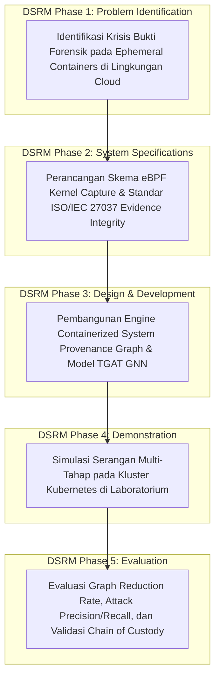

# RENCANA PROPOSAL DISERTASI DOKTORAL (DRAF CONTOH PERCONTOHAN)
## PROGRAM DOKTOR ILMU KOMPUTER (PDIK)
### FAKULTAS ILMU KOMPUTER - UNIVERSITAS DIAN NUSWANTORO

> ⚠️ **CATATAN PENTING / DISCLAIMER:**  
> Dokumen naskah proposal ini merupakan **DRAF CONTOH PERCONTOHAN (*SAMPLE DRAFT*)** yang disusun menggunakan format baku resmi PDIK UDINUS berbasis **Usulan Topik 1 (Digital Forensik Cloud Microservices & GNN)**.  
> Saat ini calon peneliti (**Pak Hario Jati Setyadi**) sedang mempertimbangkan dan memilih salah satu dari **4 Alternatif Topik Digital Forensik Unggulan** yang telah disediakan.  
> **Setelah Pak Hario menetapkan keputusan topik akhir, naskah proposal resmi final (Bab 1 s/d Daftar Pustaka) beserta file Word `.docx` akan kami susun secara menyeluruh dan komprehensif mengikuti topik pilihan beliau.**

---

### **JUDUL CONTOH PENELITIAN (BAHASA INDONESIA):**
**Kerangka Kerja Investigasi Forensik Digital Otonom Berbasis Deep Graph Learning untuk Rekonstruksi Jejak Serangan Multi-Tahap pada Lingkungan Cloud Microservices**

### **SAMPLE RESEARCH TITLE (ENGLISH):**
**Autonomous Digital Forensics Investigation Framework Based on Deep Graph Learning for Multi-Stage Attack Reconstruction in Cloud Microservices Environments**

---

### **DATA CALON PENELITI:**
* **Nama Lengkap:** Hario Jati Setyadi, S.Kom., M.Kom.
* **Nomor Induk Pegawai (NIP):** 198612182019031007
* **Nomor Induk Dosen Nasional (NIDN):** 0018128604
* **Institusi Asal:** Universitas Mulawarman, Samarinda, Kalimantan Timur
* **Program Studi Asal:** Program Studi S1 Sistem Informasi / S1 Informatika, Fakultas Teknik
* **Jabatan Profesi:** Ketua APTIKOM Provinsi Kalimantan Timur (Periode 2026–2030)
* **Bidang Minat / Peminatan:** *Digital Forensics, Cloud Security, & Applied Deep Learning*
* **SINTA ID / Scopus ID:** 6654665 / 57201347811 (h-index: 10, 89+ Publikasi, 340+ Sitasi)

---

## 1. LATAR BELAKANG MASALAH

Transformasi digital skala masif pada instansi pemerintahan (SPBE), perbankan, dan sektor industri strategis telah mendorong migrasi infrastruktur sistem informasi ke arsitektur **Cloud-Native Microservices** berbasis kontainer (Docker dan Kubernetes). Penggunaan kontainer memberikan fleksibilitas tinggi dan efisiensi sumber daya, namun memunculkan krisis fundamental dalam bidang **Digital Forensics dan Incident Response**:

1. **Sifat Kontainer yang Sementara dan Mudah Hilang (*Ephemeral Nature*):**  
   Kontainer cloud dirancang untuk dapat dibuat, dimodifikasi, dan dimusnahkan dalam hitungan detik. Ketika penyerang siber berhasil menyusup (misalnya melalui teknik *container breakout*, eksploitasi API, atau injeksi payload), penyerang dapat menghapus kontainer target seketika. Metodologi forensik digital tradisional (*dead-box forensics*) yang mengandalkan analisis citra disk permanen menjadi tidak dapat digunakan (*loss of forensic storage artifacts*).
2. **Ledakan Volume dan Kerumitan Log Audit (*Log Explosion & Dependency Chaos*):**  
   Dalam klaster microservices, jutaan rekaman peristiwa kernel (*system calls, process creation, file I/O, network socket transactions*) dihasilkan setiap menit. Penyelidik forensik manusia mengalami hambatan luar biasa untuk menyortir data log yang sangat masif (*information overload*) guna menemukan jejak kejahatan yang sesungguhnya.
3. **Ketiadaan Rekonstruksi Rantai Kausalitas Serangan Multi-Tahap (*Multi-Stage Attack Storyline Loss*):**  
   Serangan siber tingkat lanjut (*Advanced Persistent Threat / APT*) umumnya berlangsung secara bertahap dan berpindah secara lateral (*lateral movement*) antar-kontainer. Diperlukan pemodelan relasi kausalitas proses (*System Provenance Graphs*) yang terstruktur dan mampu dianalisis secara cerdas oleh model *Deep Graph Learning*.

Oleh karena itu, penelitian ini mengusulkan **Kerangka Kerja Investigasi Forensik Digital Otonom (Autonomous Cloud Forensic Framework)** yang memanfaatkan pelacakan telemetri kernel *low-overhead* (menggunakan eBPF), pemodelan graf kausalitas sistem (*Containerized System Provenance Graph*), dan algoritma *Temporal Graph Attention Network (TGAT)* untuk merekonstruksi jejak serangan multi-tahap secara otonom dan menghasilkan barang bukti digital yang terverifikasi (*court-admissible evidence*).

---

## 2. PERUMUSAN MASALAH

Rumusan masalah dalam penelitian disertasi ini adalah:
1. Bagaimana merancang meta-model graf penelusuran kausalitas (*System Provenance Graph*) yang mampu merekam interaksi proses, berkas, dan soket jaringan pada kontainer cloud *ephemeral* dengan *runtime overhead* yang sangat rendah?
2. Bagaimana memformulasikan arsitektur *Deep Graph Learning* (Temporal Graph Attention Network) untuk mereduksi kebisingan log audit (*benign graph reduction*) dan mengidentifikasi anomali serangan forensik secara akurat?
3. Bagaimana menyusun algoritma rekonstruksi rantai serangan (*Attack Storyline Generator*) yang mampu melacak titik awal kompromi (*root cause*) dan pergerakan lateral penyerang hingga membentuk laporan bukti hukum yang sah?

---

## 3. BATASAN MASALAH

1. Lingkungan pengujian difokuskan pada klaster kontainer *Docker* dan *Kubernetes* berbasis Linux.
2. Perekaman telemetri sistem memanfaatkan fasilitas *eBPF / Auditd* pada level *kernel space* tanpa merekam isi data pribadi pengguna yang sensitif.
3. Model komputasi kecerdasan buatan difokuskan pada famili *Graph Neural Networks (GNN / TGAT)*.
4. Evaluasi keberhasilan mencakup metrik *Graph Reduction Rate*, *Attack Path Precision & Recall*, *Inference Latency*, dan verifikasi rantai bukti digital (*Chain of Custody*).

---

## 4. TUJUAN PENELITIAN

1. Mengembangkan **Meta-Model Containerized System Provenance Graph (CSPG)** untuk merekam interaksi sistem kontainer secara kausal dan ringan.
2. Membangun **Model Deep Graph Learning Deteksi Anomali Forensik (TGAT Model)** untuk memangkas log normal hingga > 95% dan mengisolasi simpul serangan.
3. Menghasilkan **Mesin Rekonstruksi Rantai Serangan Multi-Tahap Otonom** yang menyajikan kronologi insiden siber secara presisi.
4. Memvalidasi kerangka kerja forensik usulan melalui uji simulasi skenario serangan nyata (*Container Escape, Reverse Shell, Privilege Escalation*) di laboratorium.

---

## 5. MANFAAT PENELITIAN

### A. Manfaat Teoretis (Keilmuan S3 Ilmu Komputer):
* Memberikan kontribusi orisinal dalam domain *Digital Forensics & Applied Graph Neural Networks* dengan memformulasikan model matematis reduksi graf kausalitas dan rekonstruksi serangan multi-tahap pada lingkungan *cloud ephemeral*.

### B. Manfaat Praktis:
* Menyediakan standar operasional dan perangkat lunak forensik otomatis bagi tim penanganan insiden siber (CSIRT) instansi pemerintah daerah, pusat data nasional di IKN, dan sektor industri perbankan.

---

## 6. TINJAUAN PUSTAKA & STATE OF THE ART (SOTA)

### Tabel Komparasi Penelitian Terdahulu (2021–2026)

| Peneliti & Tahun | Fokus & Metode | Kelebihan | Keterbatasan / Research Gap | Posisi Penelitian Ini |
| :--- | :--- | :--- | :--- | :--- |
| **Setyadi et al. (2024/2025)** | Pen-Testing ISSAF & CI/CD Docker Infrastructure | Penguasaan mendalam arsitektur kontainer & kerentanan web. | Belum mencakup investigasi forensik graf pasca-insiden. | Mengintegrasikan keahlian Docker & Security ke dalam AI-driven Digital Forensics. |
| **Hossain et al. (2022)** | Provenance Graph for Host Forensics | Menangkap relasi sistem berbasis kernel audit. | Terbatas pada OS tunggal (non-containerized), *dependency explosion*. | Merancang meta-model khusus kontainer cloud multi-tier. |
| **Wang et al. (2024)** | GNN for Threat Detection in Logs | Akurasi klasifikasi berbasis graf tinggi. | Statis, tidak mempertimbangkan urutan waktu serangan (*temporal dynamics*). | Menggunakan *Temporal Graph Attention Network (TGAT)*. |
| **Al-Dhaqm et al. (2025)** | Digital Forensic Investigation Database Models | Standarisasi metamodel bukti digital. | Tidak memiliki kemampuan inferensi dan rekonstruksi serangan otonom. | Menggabungkan model bukti forensik dengan mesin penalaran deep learning. |
| **Penelitian Ini (Hario et al., 2026)** | **Autonomous Cloud Container Forensic Framework (CSPG + TGAT)** | **Ringan (eBPF), adaptif pada ephemeral containers, reduksi log > 95%, rekonstruksi serangan otonom.** | - | **Menghadirkan framework investigasi forensik digital otonom terpadu untuk cloud microservices.** |

---

## 7. KERANGKA KERJA KONSEPTUAL & METODOLOGI PENELITIAN

Penelitian ini dilaksanakan mengikuti tahapan **Design Science Research Methodology (DSRM)**:

### Formulasi Matematis Pembobotan Relasi Kausal Graf Forensik:
Koefisien atensi temporal ($\alpha_{uv}^t$) antara simpul proses $u$ dan simpul objek sistem $v$ pada waktu $t$ diformulasikan sebagai:
$$\alpha_{uv}^t = \frac{\exp\left( \text{LeakyReLU}\left( \mathbf{a}^T [\mathbf{W}\mathbf{h}_u(t) \parallel \mathbf{W}\mathbf{h}_v(t) \parallel \mathbf{e}_{uv}^t] \right) \right)}{\sum_{k \in \mathcal{N}(u)} \exp\left( \text{LeakyReLU}\left( \mathbf{a}^T [\mathbf{W}\mathbf{h}_u(t) \parallel \mathbf{W}\mathbf{h}_k(t) \parallel \mathbf{e}_{uk}^t] \right) \right)}$$

---

## 8. ROADMAP RISET & TARGET PUBLIKASI (6 SEMESTER PDIK UDINUS)

| Semester | Target Capaian Akademik & Riset | Target Luaran Publikasi Ilmiah |
| :--- | :--- | :--- |
| **Semester 1** | Pendalaman Teori Digital Forensik, eBPF Tracing, & Filsafat Ilmu | Draft Systematic Literature Review (SOTA) |
| **Semester 2** | Pembangunan Generator Dataset Jejak Serangan Cloud & Baseline GNN | **Publikasi 1: Prosiding Konferensi Internasional IEEE (Disertasi I)** |
| **Semester 3** | Ujian Sidang Proposal Disertasi & Pengembangan Engine TGAT Kausal | **Ujian Sidang Proposal Disertasi (Disertasi II)** |
| **Semester 4** | Eksperimen Reduksi Graf, Rekonstruksi Serangan Multi-Tahap, & Validasi | **Publikasi 2: Jurnal Scopus Q1/Q2 (Disertasi III, e.g. IEEE TIFS / FSI)** |
| **Semester 5** | Penyusunan Naskah Disertasi Lengkap & Sidang Ujian Tertutup | **Ujian Sidang Tertutup Disertasi (Disertasi IV)** |
| **Semester 6** | Perbaikan Naskah, Ujian Sidang Terbuka / Promosi Doktor & Wisuda | **Ujian Sidang Terbuka / Promosi Doktor (Disertasi V)** |

---

## 9. DAFTAR PUSTAKA UTAMA

1. Al-Dhaqm, A., et al. (2025). "A Metamodeling Framework for Cloud Digital Forensics Investigation." *Journal of King Saud University - Computer and Information Sciences*, 37(2), 101890.
2. Hossain, M. N., et al. (2022). "Dependence-Preserving Data Compaction for Scalable Forensic Analysis." *USENIX Security Symposium*, 1723-1740.
3. Setyadi, H. J., et al. (2025). "Perancangan dan Pengembangan Infrastruktur Continuous Integration / Continuos Deployment Menggunakan Jenkins dan Docker." *Jurnal Tekno Kompak*, 19(1), 45-56.
4. Setyadi, H. J., et al. (2024). "Implementasi Penetration Testing Pada Sistem Informasi Terpadu Layanan Prodi Menggunakan Framework ISSAF." *Techno (Jurnal FT UMP)*, 25(2), 112-125.
5. Wang, X., et al. (2024). "Temporal Graph Neural Networks for Attack Storyline Reconstruction in Enterprise Systems." *IEEE Transactions on Information Forensics and Security*, 19, 3120-3135.
