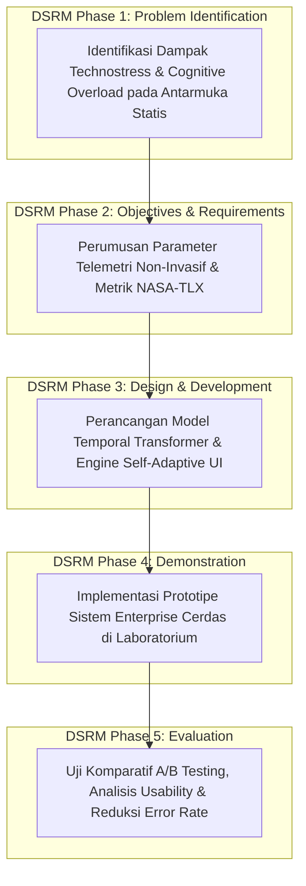

# RENCANA PROPOSAL DISERTASI DOKTORAL (DRAF CONTOH PERCONTOHAN)
## PROGRAM DOKTOR ILMU KOMPUTER (PDIK)
### FAKULTAS ILMU KOMPUTER - UNIVERSITAS DIAN NUSWANTORO

> ⚠️ **CATATAN PENTING / DISCLAIMER:**  
> Dokumen naskah proposal ini merupakan **DRAF CONTOH PERCONTOHAN (*SAMPLE DRAFT*)** yang disusun menggunakan format baku resmi PDIK UDINUS berbasis **Usulan Topik 1 (Adaptive UI & Real-Time Technostress Detection)**.  
> Saat ini calon peneliti (**Pak Hario Jati Setyadi**) masih dalam tahap eksplorasi dan memilih satu dari **4 Alternatif Topik Disertasi Unggulan** yang telah disediakan.  
> **Setelah Pak Hario menetapkan keputusan topik akhir, naskah proposal resmi final (Bab 1 s/d Daftar Pustaka) beserta file Word `.docx` akan kami susun secara menyeluruh dan komprehensif mengikuti topik pilihan beliau.**

---

### **JUDUL CONTOH PENELITIAN (BAHASA INDONESIA):**
**Kerangka Kerja Antarmuka Pengguna Adaptif Cerdas Berbasis Deteksi Beban Kognitif dan Technostress Secara Real-Time Menggunakan Deep Neural Networks**

### **SAMPLE RESEARCH TITLE (ENGLISH):**
**Intelligent Adaptive User Interface Framework Based on Real-Time Cognitive Load and Technostress Detection Using Deep Neural Networks**

---

### **DATA CALON PENELITI:**
* **Nama Lengkap:** Hario Jati Setyadi, S.Kom., M.Kom.
* **Nomor Induk Pegawai (NIP):** 198612182019031007
* **Nomor Induk Dosen Nasional (NIDN):** 0018128604
* **Institusi Asal:** Universitas Mulawarman, Samarinda, Kalimantan Timur
* **Program Studi Asal:** Program Studi S1 Sistem Informasi / S1 Informatika, Fakultas Teknik
* **Jabatan Profesi:** Ketua APTIKOM Provinsi Kalimantan Timur (Periode 2026–2030)
* **Bidang Minat / Peminatan:** *Human-Computer Interaction (HCI) & Intelligent Systems*
* **SINTA ID / Scopus ID:** 6654665 / 57201347811 (h-index: 10, 89+ Publikasi, 340+ Sitasi)

---

## 1. LATAR BELAKANG MASALAH

Dalam era transformasi digital yang masif, adopsi sistem informasi enterprise pada instansi pemerintahan (SPBE), institusi perbankan, dan perguruan tinggi telah menuntut pengguna manusia berinteraksi dengan antarmuka perangkat lunak yang memiliki kompleksitas tata kelola dan alur data yang sangat tinggi. Fenomena ini memicu timbulnya **Technostress**—kondisi tekanan psikologis dan beban kognitif berlebih (*cognitive overload*) yang dialami pengguna akibat tuntutan adaptasi teknologi yang terus-menerus.

Meskipun prinsip perancangan antarmuka pengguna (*User Interface / User Experience*) telah mengadopsi standar *Design Thinking* dan *User-Centered Design (UCD)*, implementasi antarmuka saat ini menghadapi tiga kelemahan mendasar:

1. **Antarmuka Statis yang Kaku (*Context-Blind User Interface*):**  
   Tampilan antarmuka sistem informasi umumnya bersifat statis dan tidak peka terhadap dinamika psikologis pengguna. Ketika pengguna mulai mengalami kelelahan mental atau kebingungan kognitif, antarmuka tetap menampilkan kepadatan visual (*visual clutter*) dan alur formulir yang rumit, sehingga memicu peningkatan tingkat kesalahan manusia (*human error rate*) dan penurunan kepuasan kerja.
2. **Keterbatasan Evaluasi Technostress Tradisional yang Bersifat Pasif:**  
   Sebagian besar penelitian empiris di bidang *Human-Computer Interaction (HCI)* dan sistem informasi selama ini hanya mengukur technostress secara retrospektif pasca-aktivitas menggunakan instrumen kuesioner berskala Likert (seperti SEM-PLS). Pendekatan ini tidak mampu mendeteksi timbulnya stres saat sistem sedang digunakan (*runtime*), sehingga tidak memungkinkan dilakukannya intervensi mitigasi secara *real-time*.
3. **Peluang Telemetri Perilaku Non-Invasif yang Belum Dioptimalkan:**  
   Metode deteksi stres fisiologis menggunakan sensor invasif (seperti EEG headset atau sensor galvanic skin response) sangat tidak praktis, mahal, dan mengganggu kenyamanan kerja harian. Sebaliknya, dinamika ketukan tombol (*keystroke dynamics* seperti *dwell time* dan *flight time*) serta anomali pergerakan kursor tetikus (*mouse trajectory jitter and speed*) menyajikan penanda biometrik perilaku non-invasif yang sangat potensial untuk diekstraksi menggunakan algoritma *Deep Learning*.

Oleh karena itu, diperlukan sebuah **Kerangka Kerja Antarmuka Pengguna Adaptif Cerdas (Self-Adaptive User Interface / SA-UI)** yang mampu mengestimasi beban kognitif dan tingkat technostress pengguna secara kontinu dari telemetri interaksi non-invasif, serta secara otomatis melakukan rekonfigurasi antarmuka (*dynamic UI restructuring and cognitive guidance*) guna meminimalkan stres dan mengoptimalkan performa tugas.

---

## 2. PERUMUSAN MASALAH

Rumusan masalah dalam penelitian disertasi ini adalah:
1. Bagaimana merancang meta-model kerangka kerja antarmuka pengguna adaptif cerdas yang mengintegrasikan pengumpulan telemetri perilaku non-invasif dengan mesin adaptasi antarmuka *real-time*?
2. Bagaimana memformulasikan model *Deep Neural Networks* (Temporal Transformer / CNN-LSTM) untuk mendeteksi indeks beban kognitif dan tingkat technostress secara presisi dari pola *keystroke dynamics* dan gerakan tetikus?
3. Bagaimana merancang algoritma adaptasi antarmuka otonom (*Adaptive UI Controller*) yang mampu melakukan penyederhanaan tata letak visual dan panduan alur kerja tanpa mengganggu konsistensi proses bisnis?

---

## 3. BATASAN MASALAH

1. Telemetri perilaku difokuskan pada ekstraksi parameter waktu (*temporal intervals*) dan dinamika pergerakan perangkat input (*keystroke dwell/flight time*, *mouse acceleration/clicks*) tanpa merekam konten karakter teks (*privacy-preserving / no keylogging*).
2. Pengujian prototipe dilakukan pada lingkungan aplikasi sistem informasi enterprise berbasis web.
3. Arsitektur *Deep Learning* berfokus pada model berbasis deret waktu (*Temporal Transformer / Hybrid CNN-LSTM*).
4. Metrik evaluasi mencakup akurasi prediksi beban kognitif (*F1-Score, RMSE*), *Task Completion Rate*, reduksi kesalahan klik (*misclick reduction*), dan skor beban kerja *NASA-TLX*.

---

## 4. TUJUAN PENELITIAN

1. Menghasilkan **Kerangka Kerja Antarmuka Pengguna Adaptif Cerdas (SA-UI Framework)** berbasis integrasi telemetri perilaku dan *Deep Neural Networks*.
2. Mengembangkan **Model Deep Learning Deteksi Technostress Real-Time** yang memiliki akurasi tinggi dan latensi inferensi rendah (< 100 ms).
3. Membangun **Mesin Adaptasi Antarmuka Otonom** untuk penyederhanaan visual (*Visual Pruning*), penyesuaian kontras, dan asistensi langkah kontekstual.
4. Memvalidasi efektivitas kerangka kerja usulan melalui serangkaian eksperimen komparatif (*A/B Testing*) di laboratorium.

---

## 5. MANFAAT PENELITIAN

### A. Manfaat Teoretis (Keilmuan S3 Ilmu Komputer):
* Memberikan kontribusi baru dalam domain *Intelligent Human-Computer Interaction* dan *Affective Computing* dengan memformulasikan model matematis adaptasi antarmuka otonom berbasis estimasi beban kognitif waktu-nyata.

### B. Manfaat Praktis:
* Menyediakan referensi arsitektur antarmuka cerdas yang dapat diimplementasikan pada portal layanan publik, sistem perbankan, dan platform akademik untuk mereduksi stres operator serta meminimalkan risiko *human error*.

---

## 6. TINJAUAN PUSTAKA & STATE OF THE ART (SOTA)

### Tabel Komparasi Penelitian Terdahulu (2021–2026)

| Peneliti & Tahun | Fokus & Metode | Kelebihan | Keterbatasan / Research Gap | Posisi Penelitian Ini |
| :--- | :--- | :--- | :--- | :--- |
| **Setyadi et al. (2017/2019)** | Technostress & User Performance (SEM-PLS) | Analisis faktor empiris yang mendalam pada staf universitas. | Bersifat retrospektif, tidak ada adaptasi antarmuka runtime. | Mentransformasikan riset empiris technostress ke sistem komputasi cerdas runtime. |
| **Bakaev et al. (2022)** | Rule-based Adaptive User Interfaces | Sederhana, komputasi ringan. | Kaku, gagal menangkap variasi fluktuasi stres individual. | Menggunakan Deep Learning untuk prediksi dinamis non-linier. |
| **Mundra et al. (2024)** | Stress Detection using Wearable Sensors | Akurasi data fisiologis tinggi. | Intrusif, tidak praktis untuk lingkungan kerja kantoran. | Menggunakan telemetri perilaku non-invasif (mouse & keystrokes). |
| **Zheng et al. (2025)** | Biometric Keystroke Dynamics Classification | Efektif mengenali pola pengetikan. | Hanya untuk autentikasi keamanan, belum untuk adaptasi UI. | Mengintegrasikan klasifikasi stres pengetikan dengan mesin adaptasi UI. |
| **Penelitian Ini (Hario et al., 2026)** | **Intelligent Adaptive UI based on Deep Learning & Behavioral Telemetry** | **Non-invasif, real-time, privasi terlindungi, adaptasi otonom terukur.** | - | **Menghadirkan kerangka kerja SA-UI terpadu untuk mitigasi technostress langsung saat runtime.** |

---

## 7. KERANGKA KERJA KONSEPTUAL & METODOLOGI PENELITIAN

Penelitian ini dilaksanakan mengikuti tahapan standar **Design Science Research Methodology (DSRM)**:

### Formulasi Matematis Indeks Beban Kognitif:
Indeks Beban Kognitif / Stres ($CLI_t$) pada jendela waktu $t$ diformulasikan sebagai fungsi fusi non-linier:
$$CLI_t = \sigma \left( \mathbf{W}_k \cdot \mathbf{f}_{\text{keystroke}}(t) + \mathbf{W}_m \cdot \mathbf{f}_{\text{mouse}}(t) + \mathbf{b} \right)$$

Fungsi utilitas adaptasi antarmuka ($\mathcal{U}_{\text{adapt}}$) dioptimalkan sebagai:
$$\max_{\mathcal{A}} \left[ \omega_1 \cdot \text{TaskCompletion}(\mathcal{A}) - \omega_2 \cdot CLI_t(\mathcal{A}) - \omega_3 \cdot \text{AdaptationDisturbance}(\mathcal{A}) \right]$$

---

## 8. ROADMAP RISET & TARGET PUBLIKASI (6 SEMESTER PDIK UDINUS)

| Semester | Target Capaian Akademik & Riset | Target Luaran Publikasi Ilmiah |
| :--- | :--- | :--- |
| **Semester 1** | Pendalaman Teori HCI, Filsafat Ilmu, & Perancangan Logging Telemetri | Draft Systematic Literature Review (SOTA) |
| **Semester 2** | Pengumpulan Dataset Perilaku di Lab & Pelatihan Model Deep Learning Awal | **Publikasi 1: Prosiding Konferensi Internasional IEEE (Disertasi I)** |
| **Semester 3** | Ujian Sidang Proposal Disertasi & Pembangunan Engine Adaptasi UI | **Ujian Sidang Proposal Disertasi (Disertasi II)** |
| **Semester 4** | Eksperimen A/B Testing, Evaluasi NASA-TLX & Validasi Usability Lanjutan | **Publikasi 2: Jurnal Scopus Q1/Q2 (Disertasi III, e.g. ACM TOCHI / IJHCS)** |
| **Semester 5** | Penyusunan Naskah Disertasi Lengkap & Sidang Ujian Tertutup | **Ujian Sidang Tertutup Disertasi (Disertasi IV)** |
| **Semester 6** | Perbaikan Naskah, Ujian Sidang Terbuka / Promosi Doktor & Wisuda | **Ujian Sidang Terbuka / Promosi Doktor (Disertasi V)** |

---

## 9. DAFTAR PUSTAKA UTAMA

1. Bakaev, M., et al. (2022). "Comprehensive Framework for Automated Adaptive User Interface Generation." *International Journal of Human-Computer Studies*, 165, 102854.
2. Mundra, S., et al. (2024). "Continuous Real-Time Stress Detection in Workplace Environments: A Systematic Survey." *Computers in Human Behavior*, 151, 108012.
3. Setyadi, H. J., Widagdo, P. P., & Susanto, T. D. (2017). "Cognitive Age and Chronological Age of the Technostress that Effect on Satisfaction, Performance, and Intention of Continue the Use of Information Technology." *International Conference on Information Systems*, 112-118.
4. Setyadi, H. J., et al. (2019). "An Application of the UTAUT Model for Analysis of Adoption of Integrated License Service Information System." *Procedia Computer Science*, 161, 468-475.
5. Zheng, L., et al. (2025). "Deep Behavioral Biometrics: Real-Time Keystroke Dynamics Analysis Using Temporal Transformers." *IEEE Transactions on Human-Machine Systems*, 55(1), 89-102.
