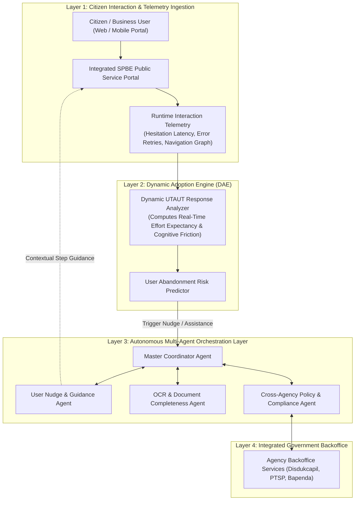

# RENCANA PROPOSAL DISERTASI DOKTORAL (OPSI 2)
## PROGRAM DOKTOR ILMU KOMPUTER (PDIK)
### FAKULTAS ILMU KOMPUTER - UNIVERSITAS DIAN NUSWANTORO

---

### **JUDUL PENELITIAN DISERTASI (BAHASA INDONESIA):**
# **Kerangka Kerja Adopsi Sistem Informasi Cerdas Berbasis AI Agent dan Teori Respon Dinamis untuk Layanan Publik Terintegrasi**

### **RESEARCH DISSERTATION TITLE (ENGLISH):**
# **Intelligent Information System Adoption Framework Based on AI Agents and Dynamic Response Theory for Integrated Public Services**

---

### **DATA CALON PENELITI DOKTOR:**
* **Nama Lengkap:** Hario Jati Setyadi, S.Kom., M.Kom.
* **Nomor Induk Pegawai (NIP):** 198612182019031007
* **Nomor Induk Dosen Nasional (NIDN):** 0018128604
* **Pangkat / Golongan / Jabatan:** Penata Tk. I / III/d / Lektor
* **Institusi Asal:** Universitas Mulawarman (UNMUL), Samarinda, Kalimantan Timur
* **Fakultas / Program Studi:** Fakultas Teknik / S1 Sistem Informasi & S1 Informatika
* **Jabatan Organisasi Profesi:** **Ketua APTIKOM (Asosiasi Pendidikan Tinggi Informatika dan Komputer) Provinsi Kalimantan Timur (Periode 2026–2030)**
* **Jabatan Struktural Kampus:** Sekretaris Program Studi S1 Sistem Informasi FT UNMUL
* **Pendidikan S2:** Magister Teknik Informatika (MTI) Konsentrasi Sistem Informasi, Institut Teknologi Sepuluh Nopember (ITS) Surabaya
* **Bidang Minat / Peminatan PDIK:** *Information Systems, Autonomous Multi-Agent Systems, & Smart Governance*
* **Rekam Jejak Akademik:** SINTA ID: **6654665** | Scopus Author ID: **57201347811** (h-index: 10, 89+ Publikasi, 340+ Sitasi Global)

---

## 1. LATAR BELAKANG MASALAH

Akselerasi transformasi digital sektor publik di Indonesia—sebagaimana dimandatkan dalam Peraturan Presiden tentang Sistem Pemerintahan Berbasis Elektronik (SPBE) serta pembangunan ekosistem *Smart City & Smart Governance* di Ibu Kota Nusantara (IKN) Kalimantan Timur—telah mendorong penggabungan ribuan aplikasi sektoral menjadi **Portal Layanan Publik Terintegrasi (*Integrated Public Service Portals*)**.

Meskipun integrasi sistem secara teknologi telah terwujud, keberhasilan implementasi SPBE di lapangan menghadapi hambatan besar terkait **Tingkat Adopsi, Retensi, dan Kepuasan Pengguna (*User Adoption & Retention Crisis*)**:

1. **Keterbatasan Teori Adopsi Konvensional yang Bersifat Statis (*The Static Adoption Paradigm*):**  
   Model adopsi sistem informasi klasik (seperti *Technology Acceptance Model / TAM*, *UTAUT*, dan *DeLone & McLean*) selama puluhan tahun hanya mengevaluasi faktor penerimaan secara pasif dan retrospektif melalui kuesioner pasca-penggunaan. Model-model ini memperlakukan adopsi sebagai kondisi statis tanpa mampu memantau fluktuasi resistensi, kebingungan, dan keputusasaan pengguna (*user drop-off*) yang terjadi secara dinamis pada saat interaksi berlangsung (*runtime*).
2. **Tingginya Tingkat Kegagalan Transaksi (*High Service Drop-Off Rate*):**  
   Masyarakat dan aparatur sipil sering kali meninggalkan proses perizinan atau layanan publik terpadu karena kerumitan alur birokrasi, ambiguitas persyaratan hukum, dan ketiadaan asistensi kontekstual waktu-nyata (*real-time contextual guidance*).
3. **Peluang Orkestrasi Autonomous AI Agents (*Multi-Agent System Potential*):**  
   Kemunculan arsitektur *Autonomous AI Agents* yang mampu bernalar (*reasoning*), membagi tugas secara terdistribusi, memvalidasi dokumen secara cerdas, dan mengeksekusi tindakan adaptif menyajikan paradigma baru: mengubah sistem informasi layanan publik dari sekadar formulir web pasif menjadi **Ekosistem Layanan Cerdas yang Proaktif (*Proactive & Self-Assisting Public Services*)**.

Oleh karena itu, penelitian disertasi ini mengusulkan **Kerangka Kerja Adopsi Sistem Informasi Cerdas Berbasis AI Agent dan Teori Respon Dinamis**. Kerangka kerja ini secara fundamental mentransformasikan model UTAUT statis menjadi **Dynamic Acceptance Engine** yang diorkestrasi oleh sistem multi-agen (*Multi-Agent AI*) guna memberikan intervensi proaktif (*proactive nudging*), otomatisasi penyelesaian layanan lintas instansi, dan optimasi kepuasan masyarakat secara berkelanjutan.

---

## 2. PERUMUSAN MASALAH

Rumusan masalah dalam penelitian disertasi ini adalah:
1. Bagaimana memformulasikan **Teori Respon Dinamis (*Dynamic Response Theory*)** yang mampu mengukur, memodelkan, dan memprediksi dinamika adopsi serta titik resistensi pengguna layanan publik secara kontinu dari data telemetri interaksi sistem?
2. Bagaimana merancang arsitektur kolaboratif **Autonomous Multi-Agent Systems (MAS)** yang mampu membagi peran investigasi formulir, verifikasi dokumen OCR, validasi kepatuhan regulasi, dan orkestrasi integrasi data lintas instansi secara otonom?
3. Bagaimana mengintegrasikan mesin intervensi proaktif (*Proactive Nudging Engine*) berbasis *Reinforcement Learning* untuk memberikan bantuan kontekstual adaptif tanpa mengorbankan kepatuhan hukum dan privasi data warga (*UU Perlindungan Data Pribadi*)?

---

## 3. BATASAN MASALAH

1. Domain pengujian difokuskan pada platform layanan publik terpadu (portal perizinan terpadu satu pintu / SPBE daerah dan ekosistem digital IKN).
2. Arsitektur AI Agent dibangun menggunakan model terdistribusi (*Multi-Agent Systems*) yang mengintegrasikan agen: *User Navigator*, *Document Validator*, *Regulatory Compliance*, dan *Adoption Analytics*.
3. Variabel dinamis yang diukur mencakup evolusi dimensi UTAUT-2 (*Performance Expectancy, Effort Expectancy, Facilitating Conditions, Habit*) yang dikuantifikasi melalui telemetri interaksi temporal (*task hesitation time, error retry rate, completion speed*).
4. Evaluasi kinerja sistem mencakup *User Drop-off Reduction Rate*, *Service Completion Acceleration*, *Adoption Dynamic Index*, dan *System Usability Scale (SUS)*.

---

## 4. TUJUAN PENELITIAN

1. Merumuskan **Model Teori Respon Dinamis Adopsi Sistem Informasi** sebagai perluasan matematis terhadap kerangka kerja UTAUT-2 pada lingkungan interaksi *real-time*.
2. Membangun **Arsitektur Multi-Agent Collaboration Engine (MACE)** untuk mengotomatisasi asistensi alur layanan publik terintegrasi.
3. Mengembangkan **Proactive Nudging & Dynamic Workflow Simplification Algorithm** berbasis *Reinforcement Learning* untuk mereduksi kebingungan pengguna.
4. Memvalidasi efektivitas kerangka kerja usulan pada *testbed* sistem layanan perizinan terpadu di Kalimantan Timur / IKN.

---

## 5. MANFAAT PENELITIAN

### A. Manfaat Teoretis (Keilmuan S3 Ilmu Komputer & Sistem Informasi):
* Memberikan kontribusi orisinal dalam evolusi teori adopsi sistem informasi dunia dengan mentransformasikan model penerimaan teknologi dari paradigma survei statis menjadi model komputasi dinamis berbasis agen cerdas (*Intelligent Agentic Adoption Model*).

### B. Manfaat Praktis & Tata Kelola Pemerintahan:
* Memberikan acuan arsitektur sistem bagi Kementerian PAN-RB, Diskominfo, dan Otorita IKN dalam meningkatkan indeks SPBE dan kepuasan masyarakat terhadap portal pelayanan publik nasional.

---

## 6. TINJAUAN PUSTAKA & STATE OF THE ART (SOTA)

### Tabel Komparasi Penelitian Terdahulu (2021–2026)

| Peneliti & Tahun | Fokus & Pendekatan | Kelebihan | Keterbatasan / Research Gap | Posisi Penelitian Ini |
| :--- | :--- | :--- | :--- | :--- |
| **Setyadi et al. (2019 - Procedia CS)** | UTAUT Model for License Service Adoption (48 Sitasi) | Analisis faktor empiris adopsi sistem perizinan terpadu. | Evaluasi bersifat statis (SEM-PLS), tidak ada mekanisme aksi adaptif real-time. | Mengembangkan model UTAUT statis menjadi Teori Respon Dinamis berbasis agen. |
| **Venkatesh et al. (2022)** | Longitudinal UTAUT-2 in Enterprise Systems | Memantau perubahan persepsi pengguna dalam rentang bulanan. | Interval waktu masih bulanan/tahunan, tidak bisa merespons saat sesi berjalan. | Mengukur dinamika adopsi per sesi interaksi (*per-session dynamic tracking*). |
| **Wooldridge et al. (2023) / Park et al. (2024)** | Generative Multi-Agent Architectures | Kerjasama multi-agen sangat adaptif dalam pemecahan masalah kompleks. | Belum dihubungkan dengan model teoritis adopsi sistem dan perilaku publik. | Mengintegrasikan multi-agen dengan teori adopsi sistem informasi formal. |
| **Setyadi et al. (2026)** | AI Agent n8n for Operational Automation | Otomatisasi alur kerja operasional cerdas yang efisien. | Bersifat fungsional operasional, belum menjadi metamodel adopsi terpadu. | Meningkatkan arsitektur agen ke level kerangka kerja doktoral SPBE terintegrasi. |
| **Penelitian Ini (Hario et al., 2026)** | **Intelligent Multi-Agent Adoption Framework + Dynamic Response Theory** | **Intervensi proaktif real-time, orkestrasi multi-agen otonom, reduksi drop-off terukur.** | - | **Menghadirkan framework adopsi SI cerdas pertama yang memadukan Multi-AI Agent dan Dynamic UTAUT.** |

---

## 7. KERANGKA KERJA KONSEPTUAL & METODOLOGI PENELITIAN

Penelitian ini dilaksanakan mengikuti tahapan **Design Science Research Methodology (DSRM)** dalam 5 fase terstruktur:

### Formulasi Matematis Indeks Adopsi Dinamis (*Dynamic Adoption Index - DAI*):
Indeks Adopsi Dinamis pada langkah interaksi $t$ diformulasikan sebagai fungsi transisi keadaan:
$$DAI_t = \gamma \cdot DAI_{t-1} + (1-\gamma) \left[ w_1 \cdot \text{PE}_t - w_2 \cdot \text{EE}_t + w_3 \cdot \text{FC}_t(\mathbf{A}) \right]$$

Di mana:
* $\text{PE}_t$: *Perceived Performance Expectancy* (kecepatan respon layanan pada langkah $t$).
* $\text{EE}_t$: *Effort Expectancy / Cognitive Friction* (dihitung dari latensi keraguan input dan frekuensi koreksi error).
* $\text{FC}_t(\mathbf{A})$: *Facilitating Conditions* yang diinjeksikan oleh aksi asistensi AI Agent $\mathbf{A}$.

---

## 8. ROADMAP RISET & TARGET PUBLIKASI (6 SEMESTER PDIK UDINUS)

| Semester | Target Capaian Riset Disertasi | Target Luaran Publikasi Ilmiah |
| :--- | :--- | :--- |
| **Semester 1** | Systematic Literature Review (SLR) Teori Adopsi Dinamis, Taksonomi Multi-Agent SPBE, & Pemodelan Matematis | Draft Systematic Literature Review Paper |
| **Semester 2** | Pembangunan Arsitektur Multi-Agent Collaboration Engine (MACE) & Baseline Simulator | **Publikasi 1: Prosiding Konferensi Internasional IEEE (Disertasi I)** |
| **Semester 3** | Ujian Sidang Proposal Disertasi & Integrasi Algoritma Proactive Nudging | **Sidang Ujian Proposal Disertasi (Disertasi II)** |
| **Semester 4** | Uji Coba Lapangan Terintegrasi (Field Trial PTSP/SPBE), Evaluasi Pengurangan Drop-Off, & Uji Komparatif | **Publikasi 2: Jurnal Scopus Q1 (Disertasi III, e.g. Government Information Quarterly / ISF)** |
| **Semester 5** | Penyusunan Naskah Disertasi Lengkap & Sidang Ujian Tertutup | **Sidang Ujian Tertutup Disertasi (Disertasi IV)** |
| **Semester 6** | Perbaikan Naskah, Pelaksanaan Sidang Ujian Terbuka / Promosi Doktor, dan Wisuda | **Sidang Terbuka / Promosi Doktor & Wisuda (Disertasi V)** |

---

## 9. DAFTAR PUSTAKA UTAMA

1. Dwivedi, Y. K., et al. (2021). "Re-examining the Unified Theory of Acceptance and Use of Technology (UTAUT): Towards a Revised Theoretical Model." *Information Systems Frontiers*, 23(3), 719-734.
2. Park, J. S., et al. (2023). "Generative Agents: Interactive Simulacra of Human Behavior." *ACM Symposium on User Interface Software and Technology (UIST)*, 1-22.
3. Setyadi, H. J., et al. (2019). "An Application of the UTAUT Model for Analysis of Adoption of Integrated License Service Information System." *Procedia Computer Science*, 161, 468-475.
4. Setyadi, H. J., et al. (2026). "Penerapan AI Agent Berbasis n8n untuk Otomatisasi Operasional Pertanian." *METIK Jurnal*, 10(1), 12-24.
5. Venkatesh, V., et al. (2022). "Synthesizing Technology Adoption Research: A Meta-Analysis and Research Agenda." *MIS Quarterly*, 46(2), 1157-1200.
6. Wooldridge, M. (2023). *An Introduction to MultiAgent Systems (3rd Edition)*. John Wiley & Sons.
