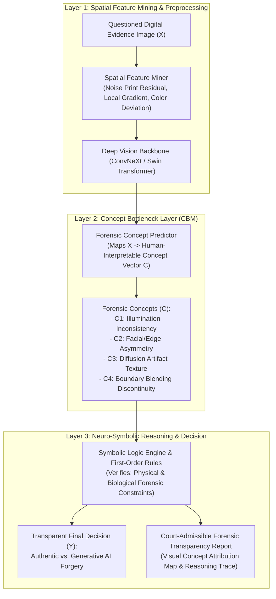

# 🎓 Master Repositori Proposal Disertasi Doktoral (PDIK UDINUS)
### **Kandidat Calon Doktor: Hario Jati Setyadi, S.Kom., M.Kom.**
**Afiliasi Institusi:** Program Studi S1 Sistem Informasi / S1 Informatika, Fakultas Teknik, Universitas Mulawarman  
**Jabatan Profesi:** **Ketua APTIKOM (Asosiasi Pendidikan Tinggi Informatika dan Komputer) Provinsi Kalimantan Timur (Periode 2026–2030)**  
**Program Studi Tujuan:** Program Doktor Ilmu Komputer (PDIK), Universitas Dian Nuswantoro (UDINUS)  
**Bidang Minat & Spesialisasi:** **DIGITAL FORENSIK, EXPLAINABLE AI & COMPUTER VISION**

---

### 🏆 **TOPIK DISERTASI PILIHAN DEFINITIF KANDIDAT:**
> ## **"Arsitektur Neuro-Symbolic Concept Bottleneck Berbasis Spatial Feature Mining untuk Deteksi dan Transparansi Bukti Digital Gambar Generatif AI"**
> *(English: "Neuro-Symbolic Concept Bottleneck Architecture Based on Spatial Feature Mining for Detection and Transparency of Generative AI Digital Image Evidence")*

---

## 👤 Profil Akademik Calon Mahasiswa S3

| Parameter | Keterangan Data Resmi |
| :--- | :--- |
| **Nama Lengkap & Gelar** | **Hario Jati Setyadi, S.Kom., M.Kom.** |
| **NIP / NIDN** | `198612182019031007` / `0018128604` |
| **Status Kepegawaian** | Dosen Pegawai Negeri Sipil (PNS) Tetap Kemdiktisaintek RI (Lektor) |
| **Afiliasi Institusi** | Program Studi S1 Sistem Informasi, Fakultas Teknik, Universitas Mulawarman |
| **Jabatan Organisasi Profesi** | **Ketua APTIKOM Provinsi Kalimantan Timur (Periode 2026–2030)** |
| **Jabatan Struktural Kampus** | Sekretaris Program Studi S1 Sistem Informasi FT UNMUL |
| **Pendidikan S2** | S2 Magister Teknik Informatika (MTI) Konsentrasi Sistem Informasi, Institut Teknologi Sepuluh Nopember (ITS) Surabaya |
| **Scopus Author ID** | **57201347811** |
| **Scopus / Global h-index** | **10** *(Sangat Tinggi & Luar Biasa untuk Calon Mahasiswa S3)* |
| **Global Citations / i10-index** | **~340+ Sitasi Global** / **i10-index: 11** (89+ Karya Ilmiah) |
| **SINTA Author ID** | **6654665** |

---

## 🏗️ Desain Arsitektur Disertasi Definitif



---

## 📂 Struktur Direktori Repositori

```text
antonprafanto/hario
├── README.md                                                                # Master Index & Dokumentasi Repositori Definitif
│
├── 00_PROFILING/
│   └── profil_lengkap_hario_jati_setyadi.md                                 # Profil Akademik Mendalam & Terverifikasi
│
├── 01_USULAN_TOPIK_DISERTASI/
│   ├── Topik_Pilihan_Definitif_Neuro_Symbolic_Concept_Bottleneck.md         # [DEFINITIF] Dokumen Arsitektur Teknis Pilihan Pak Hario
│   ├── README_Eksplorasi_Topik.md                                           # Rekam Jejak Analisis 4 Opsi Topik Digital Forensik
│   ├── Topik_01_Cloud_Container_Digital_Forensics_GNN.md                   # Arsip Opsi 1 (Cloud Container Forensics)
│   ├── Topik_02_Multimedia_Deepfake_Forgery_Forensics.md                   # Arsip Opsi 2 (Multimedia & Deepfake Forensics)
│   ├── Topik_03_Live_Memory_Forensics_IoT_Malware.md                       # Arsip Opsi 3 (Live Memory IoT Forensics)
│   └── Topik_04_AI_Agent_Digital_Forensics_Triage.md                      # Arsip Opsi 4 (Multi-Agent Forensic Triage)
│
├── 02_PANDUAN_WAWANCARA_DAN_STRATEGI_PDIK/
│   ├── Buku_Saku_Wawancara_PDIK_Hario_Jati_Setyadi.md                      # Buku Saku Wawancara Definitif (Format Markdown)
│   └── Buku_Saku_Wawancara_PDIK_Hario_Jati_Setyadi.docx                    # Buku Saku Wawancara Definitif Resmi (Format Word)
│
└── 03_DRAFT_PROPOSAL_RESMI_PDIK/
    ├── Draft_Naskah_Proposal_Disertasi_PDIK_Hario_Jati_Setyadi.md           # Naskah Proposal Disertasi Definitif Resmi PDIK
    └── Rencana_Proposal_Disertasi_Hario_Jati_Setyadi_PDIK_UDINUS.docx         # Naskah Proposal Word Resmi Siap Kirim/Cetak
```

---
*Repositori ini dipersiapkan secara presisi untuk pendaftaran Program Doktor Ilmu Komputer (PDIK) Universitas Dian Nuswantoro (UDINUS).*
