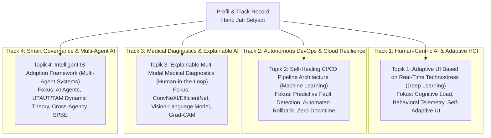

# 🎓 Master Repositori Usulan Proposal Disertasi Doktoral (PDIK UDINUS)
### **Kandidat Calon Doktor: Hario Jati Setyadi, S.Kom., M.Kom.**
**Afiliasi Institusi:** Program Studi S1 Sistem Informasi / S1 Informatika, Fakultas Teknik, Universitas Mulawarman  
**Jabatan Profesi:** **Ketua APTIKOM (Asosiasi Pendidikan Tinggi Informatika dan Komputer) Provinsi Kalimantan Timur (Periode 2026–2030)**  
**Program Studi Tujuan:** Program Doktor Ilmu Komputer (PDIK), Universitas Dian Nuswantoro (UDINUS)  
**Bidang Minat Riset:** *Human-Computer Interaction (HCI), Technostress, Applied Deep Learning & Autonomous Systems*

---

> ℹ️ **STATUS ALUR KERJA & PANDUAN PENGGUNAAN:**  
> 1. **Fase Saat Ini (Eksplorasi & Pemilihan Topik):** Calon mahasiswa (Pak Hario) sedang meninjau dan mempertimbangkan **4 Usulan Alternatif Topik Disertasi** yang ada di folder [`01_USULAN_TOPIK_DISERTASI/`](./01_USULAN_TOPIK_DISERTASI/).  
> 2. **Status Dokumen Proposal & Buku Saku Saat Ini:** Dokumen pada folder [`02_PANDUAN_WAWANCARA_DAN_STRATEGI_PDIK/`](./02_PANDUAN_WAWANCARA_DAN_STRATEGI_PDIK/) dan [`03_DRAFT_PROPOSAL_RESMI_PDIK/`](./03_DRAFT_PROPOSAL_RESMI_PDIK/) saat ini merupakan **CONTOH / ILUSTRASI PERCONTOHAN BERBASIS TOPIK 1** untuk memberikan gambaran standar kedalaman naskah dan kesiapan wawancara.  
> 3. **Fase Selanjutnya (Finalisasi Pilihan):** Begitu Pak Hario telah menetapkan topik definitif yang paling beliau sukai (apakah Topik 1, 2, 3, atau 4), **naskah proposal lengkap dan buku saku wawancara akan disusun ulang secara komprehensif mengikuti topik pilihan akhir tersebut**.

---

## 👤 Sekilas Profil Akademik Calon Mahasiswa S3

| Parameter | Keterangan Data Resmi |
| :--- | :--- |
| **Nama Lengkap & Gelar** | **Hario Jati Setyadi, S.Kom., M.Kom.** |
| **NIP / NIDN** | `198612182019031007` / `0018128604` |
| **Status Kepegawaian** | Dosen Pegawai Negeri Sipil (PNS) Tetap Kemdiktisaintek RI (Lektor) |
| **Afiliasi Institusi** | Program Studi S1 Sistem Informasi, Fakultas Teknik, Universitas Mulawarman |
| **Jabatan Organisasi Profesi** | **Ketua APTIKOM Provinsi Kalimantan Timur (Periode 2026–2030)** |
| **Jabatan Struktural Kampus** | Sekretaris Program Studi S1 Sistem Informasi FT UNMUL |
| **Pendidikan S2** | S2 Magister Teknik Informatika (MTI) Konsentrasi Sistem Informasi, Institut Teknologi Sepuluh Nopember (ITS) Surabaya |
| **Scopus Author ID** | **57201347811** |
| **Scopus / Global h-index** | **10** *(Sangat Tinggi & Luar Biasa untuk Calon Mahasiswa S3)* |
| **Global Citations / i10-index** | **~340+ Sitasi Global** / **i10-index: 11** (89+ Karya Ilmiah) |
| **SINTA Author ID** | **6654665** |

---

## 🏛️ 4 Usulan Topik Disertasi untuk Dipilih



1. **[Topik 1 (Rekomendasi Utama)]** [**Intelligent Adaptive User Interface Framework Based on Real-Time Cognitive Load and Technostress Detection Using Deep Neural Networks**](./01_USULAN_TOPIK_DISERTASI/Topik_01_Adaptive_HCI_Technostress_Deep_Learning.md)  
   *Target Publikasi:* *ACM Transactions on Computer-Human Interaction (TOCHI)* (Q1) / *International Journal of Human-Computer Studies* (Q1).
2. **[Topik 2 (Cloud / DevOps Track)]** [**Autonomous and Self-Healing CI/CD Pipeline Architecture Based on Predictive Machine Learning for Large-Scale Microservices Deployment**](./01_USULAN_TOPIK_DISERTASI/Topik_02_Self_Healing_CICD_Cloud_Microservices.md)  
   *Target Publikasi:* *IEEE Transactions on Software Engineering* (Q1) / *Journal of Systems and Software* (Q1).
3. **[Topik 3 (Medical AI Track)]** [**Explainable Multi-Modal Deep Learning Framework for Medical Diagnostics with Human-in-the-Loop Decision Support**](./01_USULAN_TOPIK_DISERTASI/Topik_03_Explainable_Multimodal_Medical_AI.md)  
   *Target Publikasi:* *IEEE Journal of Biomedical and Health Informatics* (Q1) / *Artificial Intelligence in Medicine* (Q1).
4. **[Topik 4 (Smart Governance Track)]** [**Intelligent Information System Adoption Framework Based on AI Agents and Dynamic Response Theory for Integrated Public Services**](./01_USULAN_TOPIK_DISERTASI/Topik_04_Smart_Governance_AI_Agent_Adoption.md)  
   *Target Publikasi:* *Government Information Quarterly* (Q1) / *Information Systems Frontiers* (Q1).

---

## 📊 Matriks Komparasi 4 Alternatif Topik

| Parameter | Topik 1 (Adaptive UI & Technostress) | Topik 2 (Self-Healing CI/CD) | Topik 3 (Explainable Medical AI) | Topik 4 (Multi-Agent Adoption) |
| :--- | :--- | :--- | :--- | :--- |
| **Fokus Riset** | *Adaptive Interface & Stress Reduction* | *Predictive DevOps & Zero-Downtime* | *Multi-Modal Medical Imaging* | *Multi-Agent SPBE Adoption* |
| **Basis Algoritma/Model** | CNN-LSTM / Transformer, Keystroke Dynamics | Predictive GBDT, Bayesian Optimization | ConvNeXt, EfficientNet, VLM, Grad-CAM | Multi-Agent Systems (n8n/LLM), Dynamic UTAUT |
| **Linearitas Profil** | Tesis S2 ITS (Technostress) & UI/UX | Publikasi Jenkins/Docker 2025 & Jaringan | Publikasi ConvNeXt 2026 & EfficientNet | Publikasi Procedia CS (48 Sitasi) & AI Agent |
| **Tingkat Komputasi** | Tinggi (Time-Series & Multimodal DL) | Tinggi (Pipeline Automation & Telemetry) | Tinggi (Computer Vision & Medical VLM) | Menengah–Tinggi (Agent Orchestration) |
| **Target Luaran** | ACM TOCHI / IJHCS (Q1) | IEEE TSE / JSS (Q1) | IEEE JBHI / AI in Medicine (Q1) | Gov. Information Quarterly / ISF (Q1) |

---

## 📂 Struktur Direktori Repositori

```text
antonprafanto/hario
├── README.md                                                        # Master Index & Dokumentasi Repositori
│
├── 00_PROFILING/
│   └── profil_lengkap_hario_jati_setyadi.md                         # Profil Akademik Mendalam & Terverifikasi
│
├── 01_USULAN_TOPIK_DISERTASI/
│   ├── README_Eksplorasi_Topik.md                                   # Analisis & Matriks Komparasi 4 Topik
│   ├── Topik_01_Adaptive_HCI_Technostress_Deep_Learning.md         # [Rekomendasi Utama] Adaptive UI & Technostress
│   ├── Topik_02_Self_Healing_CICD_Cloud_Microservices.md           # [DevOps Track] Self-Healing CI/CD Pipeline
│   ├── Topik_03_Explainable_Multimodal_Medical_AI.md                # [Medical AI Track] Explainable Multi-Modal AI
│   └── Topik_04_Smart_Governance_AI_Agent_Adoption.md              # [Smart Gov Track] Multi-Agent System Adoption
│
├── 02_PANDUAN_WAWANCARA_DAN_STRATEGI_PDIK/
│   └── Buku_Saku_Wawancara_PDIK_Hario_Jati_Setyadi.md              # [CONTOH TOPIK 1] Buku Saku & FAQ Promotor S3
│
└── 03_DRAFT_PROPOSAL_RESMI_PDIK/
    ├── Draft_Naskah_Proposal_Disertasi_PDIK_Hario_Jati_Setyadi.md   # [CONTOH TOPIK 1] Naskah Proposal Markdown
    └── Rencana_Proposal_Disertasi_Hario_Jati_Setyadi_PDIK_UDINUS.docx # [CONTOH TOPIK 1] Dokumen Word Resmi
```

---
*Repositori ini dipersiapkan secara presisi untuk pendaftaran Program Doktor Ilmu Komputer (PDIK) Universitas Dian Nuswantoro (UDINUS).*
