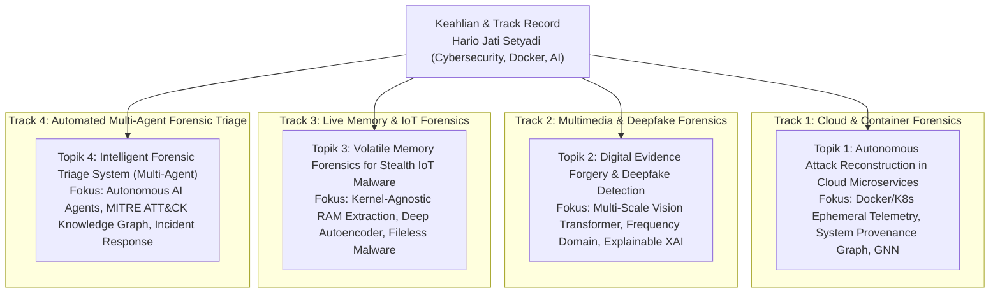

# 🎓 Master Repositori Usulan Proposal Disertasi Doktoral (PDIK UDINUS)
### **Kandidat Calon Doktor: Hario Jati Setyadi, S.Kom., M.Kom.**
**Afiliasi Institusi:** Program Studi S1 Sistem Informasi / S1 Informatika, Fakultas Teknik, Universitas Mulawarman  
**Jabatan Profesi:** **Ketua APTIKOM (Asosiasi Pendidikan Tinggi Informatika dan Komputer) Provinsi Kalimantan Timur (Periode 2026–2030)**  
**Program Studi Tujuan:** Program Doktor Ilmu Komputer (PDIK), Universitas Dian Nuswantoro (UDINUS)  
**Bidang Minat Riset Pilihan:** **DIGITAL FORENSIK & KEAMANAN INFORMASI (Cybersecurity & Digital Forensics)**

---

> ℹ️ **STATUS ALUR KERJA & PANDUAN PENGGUNAAN:**  
> 1. **Fase Saat Ini (Eksplorasi & Pemilihan Topik Digital Forensik):** Berdasarkan arahan Pak Hario yang menginginkan bidang **Digital Forensik**, telah dirumuskan **4 Usulan Alternatif Topik Disertasi Doktoral** di folder [`01_USULAN_TOPIK_DISERTASI/`](./01_USULAN_TOPIK_DISERTASI/).  
> 2. **Status Dokumen Proposal & Buku Saku Saat Ini:** Dokumen pada folder [`02_PANDUAN_WAWANCARA_DAN_STRATEGI_PDIK/`](./02_PANDUAN_WAWANCARA_DAN_STRATEGI_PDIK/) dan [`03_DRAFT_PROPOSAL_RESMI_PDIK/`](./03_DRAFT_PROPOSAL_RESMI_PDIK/) saat ini merupakan **CONTOH / ILUSTRASI PERCONTOHAN BERBASIS TOPIK 1 (Cloud Container Digital Forensics)** untuk memberikan gambaran standar kedalaman naskah dan kesiapan wawancara.  
> 3. **Fase Selanjutnya (Finalisasi Pilihan):** Begitu Pak Hario telah menetapkan satu dari 4 opsi digital forensik yang paling beliau minati, **naskah proposal lengkap dan buku saku wawancara akan disusun ulang secara komprehensif mengikuti topik pilihan akhir tersebut**.

---

## 👤 Sekilas Profil Akademik Calon Mahasiswa S3

| Parameter | Keterangan Data Resmi |
| :--- | :--- |
| **Nama Lengkap & Gelar** | **Hario Jati Setyadi, S.Kom., M.Kom.** |
| **NIP / NIDN** | `198612182019031007` / `0018128604` |
| **Status Kepegawaian** | Dosen Pegawai Negeri Sipil (PNS) Tetap Kemdiktisaintek RI (Lektor) |
| **Afiliasi Institusi** | Program Studi S1 Sistem Informasi, Fakultas Teknik, Universitas Mulawarman |
| **Jabatan Organisasi Profesi** | **Ketua APTIKOM Provinsi Kalimantan Timur (Periode 2026–2030)** |
| **Jabatan Struktural Kampus** | Sekretaris Program Studi S1 Sistem Informasi FT UNMUL |
| **Pendidikan S2** | S2 Magister Teknik Informatika (MTI) Konsentrasi Sistem Informasi, Institut Teknologi Sepuluh Nopember (ITS) Surabaya |
| **Scopus Author ID** | **57201347811** |
| **Scopus / Global h-index** | **10** *(Sangat Tinggi & Luar Biasa untuk Calon Mahasiswa S3)* |
| **Global Citations / i10-index** | **~340+ Sitasi Global** / **i10-index: 11** (89+ Karya Ilmiah) |
| **SINTA Author ID** | **6654665** |

---

## 🏛️ 4 Usulan Topik Disertasi Bidang Digital Forensik



1. **[Topik 1 (Rekomendasi Utama - Cloud Track)]** [**Autonomous Digital Forensics Investigation Framework Based on Deep Graph Learning for Multi-Stage Attack Reconstruction in Cloud Microservices**](./01_USULAN_TOPIK_DISERTASI/Topik_01_Cloud_Container_Digital_Forensics_GNN.md)  
   *Target Publikasi:* *IEEE Transactions on Information Forensics and Security (TIFS)* (Q1) / *Forensic Science International: Digital Investigation* (Q1).
2. **[Topik 2 (Multimedia Forensics Track)]** [**Digital Evidence Forgery and Deepfake Detection Using Multi-Scale Vision Transformers with Calibrated Explainability Layer**](./01_USULAN_TOPIK_DISERTASI/Topik_02_Multimedia_Deepfake_Forgery_Forensics.md)  
   *Target Publikasi:* *IEEE Transactions on Multimedia* (Q1) / *Computers & Security* (Q1).
3. **[Topik 3 (Live Memory & IoT Track)]** [**Volatile Memory Forensics Framework Based on Machine Learning for Stealth Malware Evidence Extraction in Smart City IoT Devices**](./01_USULAN_TOPIK_DISERTASI/Topik_03_Live_Memory_Forensics_IoT_Malware.md)  
   *Target Publikasi:* *IEEE Internet of Things Journal* (Q1) / *Journal of Information Security and Applications* (Q1).
4. **[Topik 4 (Automated AI Agent Track)]** [**Intelligent Digital Forensic Triage System Based on Autonomous Multi-Agent Systems and Knowledge Graph Reasoning for Large-Scale Incident Response**](./01_USULAN_TOPIK_DISERTASI/Topik_04_AI_Agent_Digital_Forensics_Triage.md)  
   *Target Publikasi:* *Expert Systems with Applications* (Q1) / *Forensic Science International: Digital Investigation* (Q1).

---

## 📊 Matriks Komparasi 4 Alternatif Topik Digital Forensik

| Parameter | Topik 1 (Cloud Container Forensics) | Topik 2 (Multimedia & Deepfake) | Topik 3 (Live Memory & IoT) | Topik 4 (Multi-Agent Triage) |
| :--- | :--- | :--- | :--- | :--- |
| **Fokus Investigasi** | *Ephemeral Container Attack Chains* | *Media Forgery & Deepfake Tampering* | *Volatile RAM Fileless Malware* | *Automated Incident Response Triage* |
| **Basis Algoritma/Model** | System Provenance Graph + GNN (TGAT) | Multi-Scale ViT + Wavelet/DCT Residual | Deep Autoencoder (VAE) + Kernel Parsing | Multi-Agent LLM + Knowledge Graph |
| **Linearitas Profil** | Riset Jenkins/Docker (2025) & ISSAF | Riset ConvNeXt (2026) & EfficientNet | Riset Traffic SNMP & Pen-Testing | Riset AI Agent n8n (2026) |
| **Tingkat Komputasi** | Tinggi (Kernel Trace & Graph Learning) | Tinggi (Dual-Domain Computer Vision) | Menengah–Tinggi (Memory Carving) | Menengah–Tinggi (Agent Orchestration) |
| **Target Luaran** | IEEE TIFS / FSI: Digital Invest. (Q1) | IEEE Trans. Multimedia / C&S (Q1) | IEEE IoT Journal / JISA (Q1) | Expert Systems / FSI: Digital Invest. (Q1) |

---

## 📂 Struktur Direktori Repositori

```text
antonprafanto/hario
├── README.md                                                        # Master Index & Dokumentasi Repositori
│
├── 00_PROFILING/
│   └── profil_lengkap_hario_jati_setyadi.md                         # Profil Akademik Mendalam & Terverifikasi
│
├── 01_USULAN_TOPIK_DISERTASI/
│   ├── README_Eksplorasi_Topik.md                                   # Analisis & Matriks Komparasi 4 Topik Digital Forensik
│   ├── Topik_01_Cloud_Container_Digital_Forensics_GNN.md           # [Rekomendasi Utama] Cloud & Container Forensics GNN
│   ├── Topik_02_Multimedia_Deepfake_Forgery_Forensics.md           # [Multimedia Track] Deepfake & Evidence Forgery Forensics
│   ├── Topik_03_Live_Memory_Forensics_IoT_Malware.md               # [Memory Track] Live Volatile Memory Forensics IoT
│   └── Topik_04_AI_Agent_Digital_Forensics_Triage.md              # [AI Agent Track] Autonomous Forensic Triage System
│
├── 02_PANDUAN_WAWANCARA_DAN_STRATEGI_PDIK/
│   └── Buku_Saku_Wawancara_PDIK_Hario_Jati_Setyadi.md              # [CONTOH TOPIK 1] Buku Saku & FAQ Promotor S3
│
└── 03_DRAFT_PROPOSAL_RESMI_PDIK/
    ├── Draft_Naskah_Proposal_Disertasi_PDIK_Hario_Jati_Setyadi.md   # [CONTOH TOPIK 1] Naskah Proposal Markdown
    └── Rencana_Proposal_Disertasi_Hario_Jati_Setyadi_PDIK_UDINUS.docx # [CONTOH TOPIK 1] Dokumen Word Resmi
```

---
*Repositori ini dipersiapkan secara presisi untuk pendaftaran Program Doktor Ilmu Komputer (PDIK) Universitas Dian Nuswantoro (UDINUS).*
