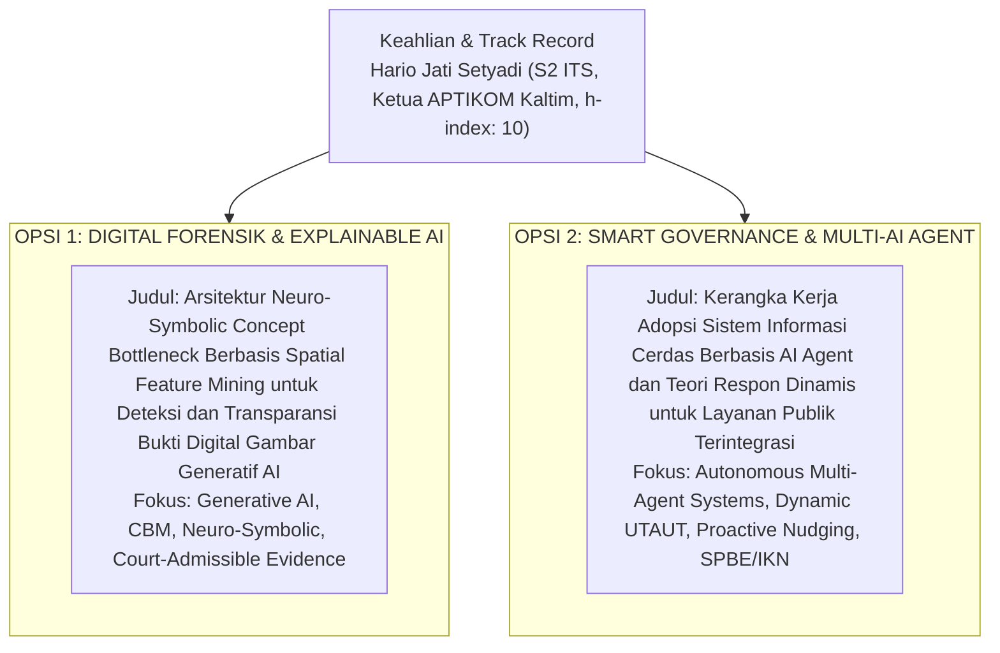

# 🎓 Master Repositori Proposal Disertasi Doktoral (PDIK UDINUS)
### **Kandidat Calon Doktor: Hario Jati Setyadi, S.Kom., M.Kom.**
**Afiliasi Institusi:** Program Studi S1 Sistem Informasi / S1 Informatika, Fakultas Teknik, Universitas Mulawarman  
**Jabatan Profesi:** **Ketua APTIKOM (Asosiasi Pendidikan Tinggi Informatika dan Komputer) Provinsi Kalimantan Timur (Periode 2026–2030)**  
**Program Studi Tujuan:** Program Doktor Ilmu Komputer (PDIK), Universitas Dian Nuswantoro (UDINUS)  
**Bidang Minat Riset:** *Digital Forensics, Autonomous Multi-Agent Systems, Explainable AI & Smart Governance*

---

## 🏛️ 2 Opsi Usulan Topik Disertasi Pilihan Unggulan Pak Hario

Repositori ini memuat **2 Pilihan Topik Disertasi Doktoral Unggulan** yang telah disusun lengkap dengan naskah proposal resmi PDIK UDINUS 10 bab, buku saku wawancara, formulasi matematis, dan berkas Word (`.docx`):



---

### 📊 Matriks Komparasi Opsi 1 vs Opsi 2

| Parameter | Opsi 1: Digital Forensik & Neuro-Symbolic CBM | Opsi 2: Smart Governance & Multi-AI Agent Adoption |
| :--- | :--- | :--- |
| **Judul Lengkap (ID)** | *Arsitektur Neuro-Symbolic Concept Bottleneck Berbasis Spatial Feature Mining untuk Deteksi dan Transparansi Bukti Digital Gambar Generatif AI* | *Kerangka Kerja Adopsi Sistem Informasi Cerdas Berbasis AI Agent dan Teori Respon Dinamis untuk Layanan Publik Terintegrasi* |
| **Judul Lengkap (EN)** | *Neuro-Symbolic Concept Bottleneck Architecture Based on Spatial Feature Mining for Detection and Transparency of Generative AI Digital Image Evidence* | *Intelligent Information System Adoption Framework Based on AI Agents and Dynamic Response Theory for Integrated Public Services* |
| **Fokus Masalah** | *Black-Box AI* pada deteksi barang bukti gambar palsu Generative AI di pengadilan | Tingginya kegagalan transaksi (*drop-off rate*) pada portal layanan publik SPBE |
| **Pilar Metodologi** | *Concept Bottleneck Models (CBM)* + *Spatial Feature Mining* + *First-Order Logic* | *Dynamic Response Theory (Dynamic UTAUT)* + *Autonomous Multi-Agent Systems (MAS)* + *Proactive Nudging* |
| **Linearitas Riset** | Publikasi *ConvNeXt (2026)*, *EfficientNet (2024)*, dan riset *Security Testing* | Publikasi *Elsevier Procedia CS (48 Sitasi)* tentang UTAUT dan *AI Agent n8n (2026)* |
| **Target Jurnal Q1** | *IEEE TIFS* / *IEEE TMM* / *Forensic Science International: Digital Investigation* | *Government Information Quarterly* / *Information Systems Frontiers* / *Expert Systems* |
| **Naskah Proposal** | [Lihat Proposal Opsi 1](./03_DRAFT_PROPOSAL_RESMI_PDIK/Opsi_1_Proposal_Disertasi_Digital_Forensik_Neuro_Symbolic_CBM.md) | [Lihat Proposal Opsi 2](./03_DRAFT_PROPOSAL_RESMI_PDIK/Opsi_2_Proposal_Disertasi_Smart_Governance_AI_Agent_Adoption.md) |
| **Buku Saku Wawancara** | [Lihat Buku Saku Opsi 1](./02_PANDUAN_WAWANCARA_DAN_STRATEGI_PDIK/Opsi_1_Buku_Saku_Wawancara_Digital_Forensik.md) | [Lihat Buku Saku Opsi 2](./02_PANDUAN_WAWANCARA_DAN_STRATEGI_PDIK/Opsi_2_Buku_Saku_Wawancara_Smart_Governance_AI_Agent.md) |

---

## 👤 Sekilas Profil Akademik Calon Mahasiswa S3

| Parameter | Keterangan Data Resmi |
| :--- | :--- |
| **Nama Lengkap & Gelar** | **Hario Jati Setyadi, S.Kom., M.Kom.** |
| **NIP / NIDN** | `198612182019031007` / `0018128604` |
| **Status Kepegawaian** | Dosen Pegawai Negeri Sipil (PNS) Tetap Kemdiktisaintek RI (Lektor) |
| **Afiliasi Institusi** | Program Studi S1 Sistem Informasi, Fakultas Teknik, Universitas Mulawarman |
| **Jabatan Organisasi Profesi** | **Ketua APTIKOM Provinsi Kalimantan Timur (Periode 2026–2030)** |
| **Jabatan Struktural Kampus** | Sekretaris Program Studi S1 Sistem Informasi FT UNMUL |
| **Pendidikan S2** | S2 Magister Teknik Informatika (MTI) Konsentrasi Sistem Informasi, Institut Teknologi Sepuluh Nopember (ITS) Surabaya |
| **Scopus Author ID** | **57201347811** |
| **Scopus / Global h-index** | **10** *(Sangat Tinggi & Luar Biasa untuk Calon Mahasiswa S3)* |
| **Global Citations / i10-index** | **~340+ Sitasi Global** / **i10-index: 11** (89+ Karya Ilmiah) |
| **SINTA Author ID** | **6654665** |

---

## 📂 Struktur Direktori Repositori

```text
antonprafanto/hario
├── README.md                                                                           # Master Index & Dokumentasi Repositori
│
├── 00_PROFILING/
│   └── profil_lengkap_hario_jati_setyadi.md                                            # Profil Akademik Mendalam & Terverifikasi
│
├── 01_USULAN_TOPIK_DISERTASI/
│   ├── Topik_Pilihan_Definitif_Neuro_Symbolic_Concept_Bottleneck.md                    # Bedah Arsitektur Opsi 1 (Digital Forensik CBM)
│   ├── Topik_04_Smart_Governance_AI_Agent_Adoption.md                                  # Bedah Arsitektur Opsi 2 (Smart Governance Multi-Agent)
│   ├── README_Eksplorasi_Topik.md                                                      # Rekam Jejak Analisis Topik
│   ├── Topik_01_Cloud_Container_Digital_Forensics_GNN.md                              # Arsip Opsi Forensik Cloud
│   ├── Topik_02_Multimedia_Deepfake_Forgery_Forensics.md                              # Arsip Opsi Forensik Deepfake
│   └── Topik_03_Live_Memory_Forensics_IoT_Malware.md                                  # Arsip Opsi Forensik Memori IoT
│
├── 02_PANDUAN_WAWANCARA_DAN_STRATEGI_PDIK/
│   ├── Opsi_1_Buku_Saku_Wawancara_Digital_Forensik.md                                 # [OPSI 1] Buku Saku Digital Forensik (Markdown)
│   ├── Opsi_1_Buku_Saku_Wawancara_Digital_Forensik.docx                               # [OPSI 1] Buku Saku Digital Forensik (Word)
│   ├── Opsi_2_Buku_Saku_Wawancara_Smart_Governance_AI_Agent.md                        # [OPSI 2] Buku Saku Smart Governance (Markdown)
│   └── Opsi_2_Buku_Saku_Wawancara_Smart_Governance_AI_Agent.docx                      # [OPSI 2] Buku Saku Smart Governance (Word)
│
└── 03_DRAFT_PROPOSAL_RESMI_PDIK/
    ├── Opsi_1_Proposal_Disertasi_Digital_Forensik_Neuro_Symbolic_CBM.md                # [OPSI 1] Proposal Digital Forensik (Markdown)
    ├── Opsi_1_Proposal_Disertasi_Digital_Forensik_Neuro_Symbolic_CBM.docx              # [OPSI 1] Proposal Digital Forensik (Word)
    ├── Opsi_2_Proposal_Disertasi_Smart_Governance_AI_Agent_Adoption.md                 # [OPSI 2] Proposal Smart Governance (Markdown)
    └── Opsi_2_Proposal_Disertasi_Smart_Governance_AI_Agent_Adoption.docx               # [OPSI 2] Proposal Smart Governance (Word)
```

---
*Repositori ini dipersiapkan secara presisi untuk pendaftaran Program Doktor Ilmu Komputer (PDIK) Universitas Dian Nuswantoro (UDINUS).*
